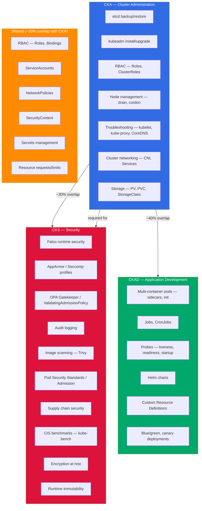
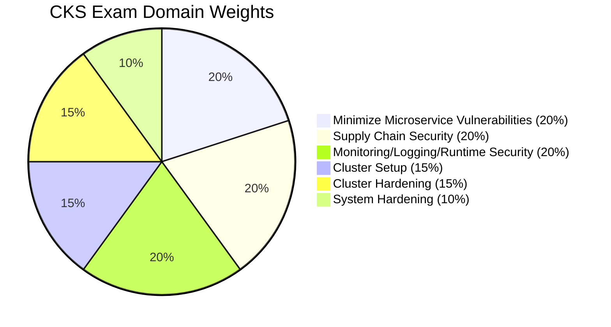
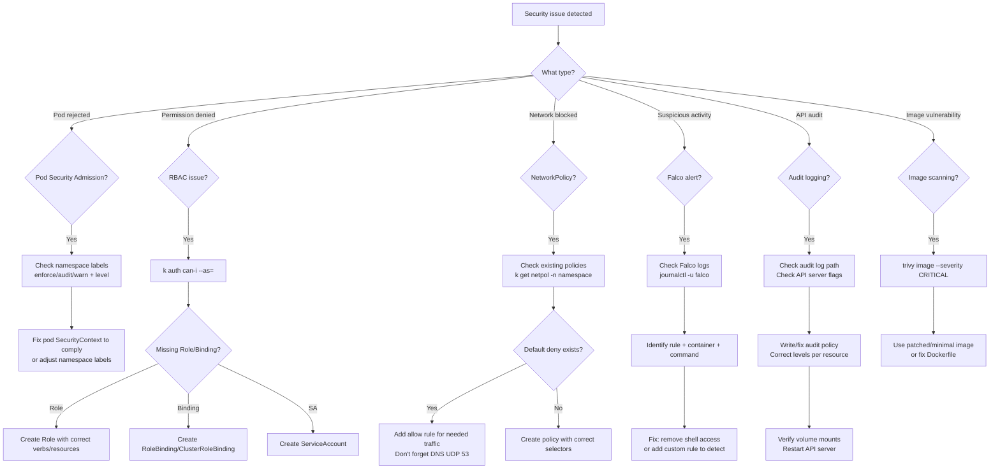

[](https://opensource.org/licenses/MIT)
[](http://makeapullrequest.com)
[]()
[]()
[]()
[](https://github.com/techwithmohamed/CKS-Certified-Kubernetes-Security-Specialist)
[](https://github.com/techwithmohamed/CKS-Certified-Kubernetes-Security-Specialist/fork)

> The most comprehensive **CKS exam study guide** for 2026 — practice questions, kubectl cheat sheet, YAML templates, 12 hands-on exercises, and expert tips for the **Certified Kubernetes Security Specialist** exam. Kubernetes v1.34. I scored **87%** — this is everything I used to prepare.

# CKS Exam Study Guide 2026 — Certified Kubernetes Security Specialist (Passed with 87%)

<p align="center">
  
</p>

I took the **CKS (Certified Kubernetes Security Specialist)** exam in March 2026 and scored **87%**. Writing this while it's fresh — partly because security-focused guides are either too shallow or too scattered across blog posts, and partly because organizing my notes helped me retain what I learned.

The [CKS](https://www.cncf.io/certification/cks/) is a hands-on, performance-based exam by the CNCF (Linux Foundation). 2 hours, roughly 15-20 tasks, no multiple choice — you solve real Kubernetes security problems in a live terminal. I prepped for about 4 weeks after passing my CKA. This repo has my notes, the commands I actually used, YAML I wrote from memory, and the mistakes I made along the way.

> Blog version of these notes: [How to Pass the CKS Certification Exam in 2026](https://techwithmohamed.com/blog/cks-exam-study-guide/)

### What's Inside

- **17 mock exam questions** with detailed solutions — scored by domain
- **12 hands-on exercises** covering all 6 CKS domains
- **18 YAML skeletons** you need to write from memory
- **kubectl security cheat sheet** — every command I used on exam day
- **4-week study plan** with daily breakdown
- **killer.sh vs real exam comparison** — difficulty, scoring, tips
- **Falco, Trivy, AppArmor, Seccomp, OPA, kube-bench** — full coverage
- **Exam day strategy** — time allocation, common mistakes, troubleshooting flowchart

If this was useful, a **star** helps others find it.

---

### Who Is This Guide For?

- You **already passed CKA** and want to take the CKS next
- You want a **structured, all-in-one study guide** instead of scattered blog posts
- You want to **practice with real YAML and commands**, not just read theory
- You're looking for **CKS 2026 practice questions** that match exam difficulty
- You want to know what **actually shows up on the CKS exam**

---

## CKS Quick Start Guide — Prepare in 4 Weeks

If you're time-pressured, here's the fast track:

1. **Run the setup script** — get your aliases and vim config right from day one: [`scripts/exam-setup.sh`](scripts/exam-setup.sh)
2. **Do the exercises** — work through the [12 hands-on exercises](exercises/) in order. Each one targets a specific CKS domain.
3. **Memorize the skeletons** — the [YAML skeletons](skeletons/) are the templates I wrote from memory during the exam. Practice until you can type them without looking.
4. **Do the mock exam** — the [17 practice questions](#practice-questions-with-answers-mock-exam) below simulate real exam weight and difficulty.
5. **Do killer.sh twice** — once 2 weeks out, once 3 days before. See [killer.sh vs the Real Exam](#killersh-vs-the-real-cks-exam).
6. **Read the exam day strategy** — the [two-pass approach](#exam-day-strategy--time-allocation) saved me at least 15 minutes.

---

## Repo Structure

```
CKS-Certified-Kubernetes-Security-Specialist/
├── README.md                          # This guide (you're here)
├── exercises/                         # 12 hands-on labs
│   ├── 01-networkpolicy-security/
│   ├── 02-cis-benchmark/
│   ├── 03-ingress-tls/
│   ├── 04-rbac-hardening/
│   ├── 05-serviceaccount-security/
│   ├── 06-apparmor-seccomp/
│   ├── 07-pod-security-standards/
│   ├── 08-secrets-management/
│   ├── 09-image-scanning-trivy/
│   ├── 10-falco-runtime-security/
│   ├── 11-audit-logging/
│   └── 12-runtime-immutability/
├── skeletons/                         # 18 YAML/config templates
│   ├── networkpolicy.yaml
│   ├── networkpolicy-deny-all.yaml
│   ├── pod-security-admission.yaml
│   ├── rbac.yaml
│   ├── clusterrole.yaml
│   ├── serviceaccount.yaml
│   ├── securitycontext.yaml
│   ├── ingress-tls.yaml
│   ├── apparmor-pod.yaml
│   ├── seccomp-pod.yaml
│   ├── audit-policy.yaml
│   ├── runtimeclass.yaml
│   ├── resourcequota.yaml
│   ├── secret.yaml
│   ├── falco-rule.yaml
│   ├── validatingadmissionpolicy.yaml
│   ├── encryption-config.yaml
│   └── Dockerfile
├── scripts/
│   └── exam-setup.sh                 # Aliases, vim config, bash completion
├── CONTRIBUTING.md
└── LICENSE
```

---

## Table of Contents

- [CKS Exam Details — Cost, Duration, Passing Score, Format](#cks-exam-details--cost-duration-passing-score-format-march-2026)
- [How Much Does the CKS Exam Cost?](#how-much-does-the-cks-exam-cost)
- [CKA vs CKAD vs CKS — Which One Should You Take?](#cka-vs-ckad-vs-cks--which-one-should-you-take)
- [CKA vs CKAD vs CKS Scope Architecture Diagram](#cka-vs-ckad-vs-cks-scope-architecture-diagram)
- [What Changed in Kubernetes v1.34 for CKS](#what-changed-in-kubernetes-v134-for-cks)
- [Before You Book the CKS Exam](#before-you-book-the-cks-exam)
- [The Exam Environment (PSI Remote Desktop)](#the-exam-environment-psi-remote-desktop)
- [First 60 Seconds — Aliases, vim, bash](#first-60-seconds--aliases-vim-bash)
- [Docs Pages I Actually Used During the Exam](#docs-pages-i-actually-used-during-the-exam)
- [kubectl Security Cheat Sheet for CKS](#kubectl-security-cheat-sheet-for-cks)
- [CKS Syllabus Breakdown (v1.34)](#cks-syllabus-breakdown-v134)
  - [Domain 1 — Cluster Setup (15%)](#domain-1--cluster-setup-15)
  - [Domain 2 — Cluster Hardening (15%)](#domain-2--cluster-hardening-15)
  - [Domain 3 — System Hardening (10%)](#domain-3--system-hardening-10)
  - [Domain 4 — Minimize Microservice Vulnerabilities (20%)](#domain-4--minimize-microservice-vulnerabilities-20)
  - [Domain 5 — Supply Chain Security (20%)](#domain-5--supply-chain-security-20)
  - [Domain 6 — Monitoring, Logging and Runtime Security (20%)](#domain-6--monitoring-logging-and-runtime-security-20)
- [CKS Domain Weight Distribution](#cks-domain-weight-distribution)
- [Exam Day Strategy — Time Allocation](#exam-day-strategy--time-allocation)
- [Mistakes That Will Fail You on the CKS](#mistakes-that-will-fail-you-on-the-cks)
- [Security Troubleshooting Flowchart](#security-troubleshooting-flowchart)
- [CKS Practice Scenarios with Full Solutions](#cks-practice-scenarios-with-full-solutions)
- [CKS Practice Questions with Answers — Mock Exam 2026](#cks-practice-questions-with-answers--mock-exam-2026)
- [Best CKS Study Resources 2026 — Free and Paid](#best-cks-study-resources-2026--free-and-paid)
- [CKS Study Plan 2026 — How to Prepare in 4-5 Weeks](#cks-study-plan-2026--how-to-prepare-in-4-5-weeks)
- [killer.sh vs the Real CKS Exam](#killersh-vs-the-real-cks-exam)
- [CKS Exam Day Checklist](#cks-exam-day-checklist)
- [CKS Study Progress Tracker](#cks-study-progress-tracker)
- [CKS YAML Templates — Write These from Memory](#cks-yaml-templates--write-these-from-memory)
- [CKS Exam FAQ — Frequently Asked Questions 2026](#cks-exam-faq--frequently-asked-questions-2026)
- [Final Words](#final-words)

---

## CKS Exam Details — Cost, Duration, Passing Score, Format (March 2026)

| **CKS Exam Details**               | **Information**                                                                                                                        |
|------------------------------------|----------------------------------------------------------------------------------------------------------------------------------------|
| **Exam Type**                      | Performance-based (live terminal — NOT multiple choice)                                                                                 |
| **Exam Duration**                  | 2 hours                                                                                                                                |
| **Passing Score**                  | 67%                                                                                                                                    |
| **Kubernetes Version**             | v1.34                                                                                                                                  |
| **Number of Questions**            | ~15-20 tasks (varies per session)                                                                                                      |
| **Exam Cost**                      | $445 USD (includes one free retake)                                                                                                    |
| **Certificate Validity**           | 2 years                                                                                                                                |
| **Exam Delivery**                  | PSI Secure Browser (remote proctored)                                                                                                  |
| **Allowed Resources**              | kubernetes.io/docs, kubernetes.io/blog, github.com/kubernetes — open in exam browser                                                   |
| **Prerequisites**                  | Must hold an active CKA certification                                                                                                  |
| **Domains Covered**                | 6 domains: Cluster Setup, Cluster Hardening, System Hardening, Microservice Vulnerabilities, Supply Chain, Monitoring/Logging/Runtime   |
| **Exam Language**                  | English, Japanese, Simplified Chinese                                                                                                  |
| **OS in Exam**                     | Ubuntu Linux terminal                                                                                                                  |

Important: the passing score is 67%, not 75% like some older guides say. It's 1% higher than CKA (66%). Still not easy — the security-specific tooling (Falco, Trivy, AppArmor, audit policies) adds complexity you didn't see on the CKA.

---

## How Much Does the CKS Exam Cost?

The CKS costs **$445 USD** as of March 2026. That includes:

- One exam attempt
- One free retake (if you fail)
- Two killer.sh simulator sessions (24 hours each)
- Access to a self-paced training course

Discount tips:
- The CNCF runs sales on Black Friday and KubeCon weeks — I've seen 30-40% off
- Linux Foundation bundles (CKA + CKS) sometimes drop to ~$600 total
- Check if your employer has a training budget — most do for certs
- Student discounts exist through the Linux Foundation

Don't pay full price if you can wait for a sale. I paid around $300 during a KubeCon promo.

---

## CKA vs CKAD vs CKS — Which One Should You Take?

| | **CKA** | **CKAD** | **CKS** |
|---|---|---|---|
| **Focus** | Cluster administration | Application development | Security |
| **Who it's for** | SREs, platform engineers, admins | Developers deploying to K8s | Security engineers, senior admins |
| **Difficulty** | Medium-Hard | Medium | Hard |
| **Duration** | 2 hours | 2 hours | 2 hours |
| **Passing Score** | 66% | 66% | 67% |
| **Cost** | $445 | $445 | $445 |
| **Prerequisites** | None | None | Must hold active CKA |
| **Key Topics** | etcd, kubeadm, RBAC, troubleshooting, networking | Pods, Deployments, Jobs, probes, volumes | Falco, AppArmor, OPA, Network Policies, audit |
| **Questions** | ~17-25 | ~15-20 | ~15-20 |
| **Typical Order** | First cert to get | First or second | After CKA |

My take: CKS is the hardest of the three. It builds on CKA — you need to know cluster admin basics AND layer security on top. If you passed CKA recently, a lot of the RBAC, NetworkPolicy, and ServiceAccount material carries over. The new stuff is Falco, AppArmor/Seccomp profiles, image scanning, audit logging, and supply chain security.

There's about 30% overlap between CKA and CKS (RBAC, NetworkPolicy, ServiceAccounts, SecurityContext). If you just passed CKA, start CKS prep immediately while it's fresh.

---

## CKA vs CKAD vs CKS Scope Architecture Diagram



---

## What Changed in Kubernetes v1.34 for CKS

If you're studying from a guide written for v1.29 or v1.30, some of it is wrong. Here's what changed that matters for the CKS:

| Feature | Status in v1.34 | CKS Impact |
|---|---|---|
| **AppArmor support** | GA | AppArmor profiles use `securityContext.appArmorProfile` field (not annotations). You'll see this on the exam. |
| **ValidatingAdmissionPolicy** | GA | CEL-based admission without webhooks. Replaces some OPA Gatekeeper use cases. Know the syntax. |
| **Pod Security Admission** | GA (since v1.25) | Replaces PodSecurityPolicy entirely. Know enforce/audit/warn modes + restricted/baseline/privileged levels. |
| **Seccomp default** | GA | RuntimeDefault seccomp profile is the standard. Know Localhost profiles too. |
| **Sidecar containers (native)** | GA | Init containers with `restartPolicy: Always`. Relevant for security sidecars (log forwarding, proxies). |
| **User namespaces** | Beta | Pods can run in isolated user namespaces. Know the concept — probably not tested yet. |
| **kubectl debug** | GA | `k debug node/<name>` and `k debug pod/<name>` — useful for security investigation tasks. |
| **Image volume source** | Beta | Mount OCI images as volumes. Know it exists for supply chain context. |

The big ones for CKS prep: AppArmor GA (field-based, not annotation-based), ValidatingAdmissionPolicy, and Pod Security Admission. If your study material still references PodSecurityPolicy, it's outdated — PSP was removed in v1.25.

---

## Before You Book the CKS Exam

Checklist I wish someone had given me:

1. **Do you have an active CKA?** CKS requires it. No exceptions. If your CKA expired, renew it first.
2. **Can you write a NetworkPolicy from scratch?** Default deny + targeted allow rules. Ingress AND egress. This is almost guaranteed.
3. **Can you configure an audit policy?** Levels (None, Metadata, Request, RequestResponse), API server flags, volume mounts.
4. **Have you used Falco?** Install it, trigger built-in rules, write a custom rule. This shows up.
5. **Can you harden a pod's SecurityContext?** readOnlyRootFilesystem, runAsNonRoot, drop ALL capabilities, no privilege escalation.
6. **Do you know how to scan images with Trivy?** `trivy image <image>` — filter by severity, know what CRITICAL/HIGH means.
7. **Have you done killer.sh at least once?** The CKS killer.sh is harder than the real exam. If you pass it, you'll pass CKS.
8. **Is your ID ready?** Government-issued ID, matching your CNCF account name. Check this before exam day.

---

## The Exam Environment (PSI Remote Desktop)

The exam runs in a PSI Secure Browser — a remote Ubuntu desktop. Same as CKA if you've done that. Some things I wish I knew:

**Copy/Paste:**
- `Ctrl+Shift+C` / `Ctrl+Shift+V` in the terminal
- Right-click paste works sometimes, sometimes it doesn't
- The built-in notepad uses normal `Ctrl+C` / `Ctrl+V`
- Practice these shortcuts. I wasted 2 minutes fumbling with paste in the first question.

**Terminal quirks:**
- There's a small delay on every keystroke — maybe 50-100ms. It adds up.
- Tab completion works but feels laggy.
- You can open multiple terminal tabs. I used two: one for the task, one for verification.
- The file browser is basic. Stick to command line.

**Browser:**
- One extra tab allowed for kubernetes.io documentation
- Bookmarks are not available — you'll type URLs manually
- The search on kubernetes.io is your best friend. Use it instead of navigating.

**General:**
- Webcam and mic are on the entire time
- Clear your desk — nothing on it except your computer
- No second monitor
- No headphones/earphones
- Water bottle is fine (clear, no label)
- Bathroom breaks are allowed but the timer doesn't pause

---

## First 60 Seconds — Aliases, vim, bash

Run this at the start of every exam session. It saves 10-15 minutes over 2 hours.

```bash
# Aliases
alias k='kubectl'
alias kn='kubectl config set-context --current --namespace'
alias kgp='kubectl get pods'
alias kgs='kubectl get svc'
alias kgn='kubectl get nodes'
alias kgnetpol='kubectl get networkpolicy'
alias kgsa='kubectl get serviceaccount'
alias kgsec='kubectl get secrets'
export do='--dry-run=client -o yaml'
export now='--force --grace-period=0'

# Tab completion
source <(kubectl completion bash)
complete -o default -F __start_kubectl k

# vim config
cat <<'EOF' >> ~/.vimrc
set expandtab
set tabstop=2
set shiftwidth=2
set number
set autoindent
EOF

# etcdctl
export ETCDCTL_API=3
```

Or just run: `source scripts/exam-setup.sh` — see [`scripts/exam-setup.sh`](scripts/exam-setup.sh)

After setting up, verify:

```bash
k get nodes          # aliases work?
k run test --image=nginx $do   # $do works?
```

---

## Docs Pages I Actually Used During the Exam

You can access kubernetes.io during the exam. Here are the pages I actually opened:

| Topic | Page |
|---|---|
| kubectl cheat sheet | https://kubernetes.io/docs/reference/kubectl/cheatsheet/ |
| NetworkPolicy | https://kubernetes.io/docs/concepts/services-networking/network-policies/ |
| Pod Security Admission | https://kubernetes.io/docs/concepts/security/pod-security-admission/ |
| Pod Security Standards | https://kubernetes.io/docs/concepts/security/pod-security-standards/ |
| RBAC | https://kubernetes.io/docs/reference/access-authn-authz/rbac/ |
| Audit logging | https://kubernetes.io/docs/tasks/debug/debug-cluster/audit/ |
| Secrets | https://kubernetes.io/docs/concepts/configuration/secret/ |
| Encrypt data at rest | https://kubernetes.io/docs/tasks/administer-cluster/encrypt-data/ |
| SecurityContext | https://kubernetes.io/docs/tasks/configure-pod-container/security-context/ |
| AppArmor | https://kubernetes.io/docs/tutorials/security/apparmor/ |
| Seccomp | https://kubernetes.io/docs/tutorials/security/seccomp/ |
| RuntimeClass | https://kubernetes.io/docs/concepts/containers/runtime-class/ |
| ServiceAccount | https://kubernetes.io/docs/concepts/security/service-accounts/ |
| Ingress TLS | https://kubernetes.io/docs/concepts/services-networking/ingress/#tls |
| ValidatingAdmissionPolicy | https://kubernetes.io/docs/reference/access-authn-authz/validating-admission-policy/ |
| Falco docs (external) | https://falco.org/docs/ |
| Trivy docs (external) | https://aquasecurity.github.io/trivy/ |

Tip: use the search bar on kubernetes.io. Don't waste time clicking through navigation menus. For Falco and Trivy, the exam environment may have man pages or `--help` output — use those during the exam since external docs aren't accessible.

---

## kubectl Security Cheat Sheet for CKS

These are the commands I used most during the exam. All using the aliases from the setup section.

### Context and Namespace

```bash
# Switch context (DO THIS BEFORE EVERY QUESTION)
k config use-context <context-name>

# Set default namespace
kn <namespace>

# Check current context
k config current-context
```

### RBAC

```bash
# Create ServiceAccount
k create sa my-sa -n my-ns

# Create Role
k create role pod-reader --verb=get,list,watch --resource=pods -n my-ns

# Create RoleBinding
k create rolebinding read-pods --role=pod-reader --serviceaccount=my-ns:my-sa -n my-ns

# Create ClusterRole
k create clusterrole node-reader --verb=get,list --resource=nodes

# Create ClusterRoleBinding
k create clusterrolebinding read-nodes --clusterrole=node-reader --serviceaccount=my-ns:my-sa

# Check permissions
k auth can-i list pods -n my-ns --as=system:serviceaccount:my-ns:my-sa
k auth can-i get secrets --as=system:serviceaccount:default:default
k auth can-i '*' '*' --as=system:serviceaccount:kube-system:default
```

### NetworkPolicy

```bash
# List policies
k get networkpolicy -n <namespace>
k describe networkpolicy <name> -n <namespace>

# Test connectivity between pods
k exec <pod-a> -- wget -qO- --timeout=2 http://<pod-b-ip>:<port>
k exec <pod-a> -- nc -zv <pod-b-ip> <port>

# Quick default deny all
cat <<EOF | k apply -f -
apiVersion: networking.k8s.io/v1
kind: NetworkPolicy
metadata:
  name: deny-all
  namespace: <namespace>
spec:
  podSelector: {}
  policyTypes:
  - Ingress
  - Egress
EOF
```

### Secrets

```bash
# Create secret
k create secret generic my-secret --from-literal=key=value -n my-ns

# Create TLS secret
k create secret tls tls-secret --cert=tls.crt --key=tls.key

# View secret (decoded)
k get secret my-secret -o jsonpath='{.data.key}' | base64 -d

# Check if secrets are encrypted at rest
cat /etc/kubernetes/manifests/kube-apiserver.yaml | grep encryption-provider-config
```

### Pod Security

```bash
# Check pod security context
k get pod <pod> -o jsonpath='{.spec.securityContext}'
k get pod <pod> -o jsonpath='{.spec.containers[*].securityContext}'

# Label namespace for Pod Security Admission
k label ns <namespace> pod-security.kubernetes.io/enforce=restricted
k label ns <namespace> pod-security.kubernetes.io/audit=restricted
k label ns <namespace> pod-security.kubernetes.io/warn=restricted

# Check namespace labels
k get ns <namespace> --show-labels
```

### Image Scanning

```bash
# Scan an image with Trivy
trivy image nginx:1.27
trivy image --severity CRITICAL,HIGH nginx:1.27
trivy image --severity CRITICAL nginx:1.27 --quiet

# Scan a Dockerfile
trivy config Dockerfile
```

### Audit Logging

```bash
# Check if audit logging is enabled
cat /etc/kubernetes/manifests/kube-apiserver.yaml | grep audit

# View audit logs
cat /var/log/kubernetes/audit/audit.log | jq .
tail -f /var/log/kubernetes/audit/audit.log | jq 'select(.verb=="create")'

# Check which API calls a user made
cat /var/log/kubernetes/audit/audit.log | jq 'select(.user.username=="system:serviceaccount:default:default")'
```

### Falco

```bash
# Check Falco status
systemctl status falco
journalctl -u falco --no-pager | tail -30

# View Falco alerts
cat /var/log/syslog | grep falco
journalctl -u falco -f

# Falco rules location
ls /etc/falco/
cat /etc/falco/falco_rules.yaml
cat /etc/falco/rules.d/
```

### Quick YAML Generation

```bash
# Pod
k run nginx --image=nginx:1.27 $do > pod.yaml

# Pod with security context
k run secure --image=nginx:1.27 $do > pod.yaml
# Then edit to add securityContext

# Service
k expose pod nginx --port=80 $do > svc.yaml

# ServiceAccount
k create sa my-sa $do > sa.yaml

# Role
k create role pod-reader --verb=get,list --resource=pods $do > role.yaml

# Secret
k create secret generic my-secret --from-literal=pass=s3cret $do > secret.yaml
```

---

## CKS Syllabus Breakdown (v1.34)

### Domain 1 — Cluster Setup (15%)

15% of the score. This is about securing the cluster infrastructure itself — network policies, CIS benchmarks, Ingress TLS, and GUI security.

> See also: [Exercise 01 — NetworkPolicy Security](exercises/01-networkpolicy-security/) | [Exercise 02 — CIS Benchmark](exercises/02-cis-benchmark/) | [Exercise 03 — Ingress TLS](exercises/03-ingress-tls/) | Skeletons: [networkpolicy.yaml](skeletons/networkpolicy.yaml), [networkpolicy-deny-all.yaml](skeletons/networkpolicy-deny-all.yaml), [ingress-tls.yaml](skeletons/ingress-tls.yaml)

#### 1.1 — Use Network Security Policies to Restrict Cluster Level Access

NetworkPolicy is your primary tool for pod-to-pod traffic control. Once you apply any NetworkPolicy to a pod, all traffic not explicitly allowed is denied for that pod.

```yaml
# Default deny all — apply first, then open specific traffic
apiVersion: networking.k8s.io/v1
kind: NetworkPolicy
metadata:
  name: deny-all
  namespace: production
spec:
  podSelector: {}
  policyTypes:
  - Ingress
  - Egress
```

```yaml
# Allow specific traffic
apiVersion: networking.k8s.io/v1
kind: NetworkPolicy
metadata:
  name: api-policy
  namespace: production
spec:
  podSelector:
    matchLabels:
      app: api
  policyTypes:
  - Ingress
  - Egress
  ingress:
  - from:
    - podSelector:
        matchLabels:
          app: frontend
    ports:
    - protocol: TCP
      port: 8080
  egress:
  - to:
    - podSelector:
        matchLabels:
          app: database
    ports:
    - protocol: TCP
      port: 5432
  # Always allow DNS
  - to: []
    ports:
    - protocol: UDP
      port: 53
```

Critical gotcha: if you add an Egress policy, you must also allow DNS (UDP 53). Otherwise the pod can't resolve service names and everything looks broken even though the policy is "correct."

Another gotcha: `from` with multiple selectors in one rule = AND. Multiple rules = OR.

```yaml
# AND — must match BOTH namespace AND pod label
ingress:
- from:
  - namespaceSelector:
      matchLabels:
        env: prod
    podSelector:
      matchLabels:
        app: frontend

# OR — matches namespace OR pod label
ingress:
- from:
  - namespaceSelector:
      matchLabels:
        env: prod
- from:
  - podSelector:
      matchLabels:
        app: frontend
```

This difference tripped me up during practice. Read the indentation carefully.

#### 1.2 — Use CIS Benchmark to Review the Security Configuration of Kubernetes Components

CIS benchmarks are security best practices published by the Center for Internet Security. **kube-bench** is the tool that checks your cluster against these benchmarks.

```bash
# Run kube-bench
kube-bench run --targets=master
kube-bench run --targets=node
kube-bench run --targets=etcd

# Check specific section
kube-bench run --targets=master --check=1.2.16

# Common findings to fix
# 1.2.16 — Ensure admission control plugin PodSecurityPolicy/PodSecurity is set
# 1.2.18 — Ensure audit logging is enabled
# 4.2.1 — Ensure kubelet anonymous auth is disabled
```

Common API server hardening flags:
```bash
# In /etc/kubernetes/manifests/kube-apiserver.yaml
--anonymous-auth=false
--authorization-mode=Node,RBAC
--enable-admission-plugins=NodeRestriction
--audit-log-path=/var/log/kubernetes/audit/audit.log
--audit-policy-file=/etc/kubernetes/audit/policy.yaml
--profiling=false
--insecure-port=0
```

Kubelet hardening (`/var/lib/kubelet/config.yaml`):
```yaml
authentication:
  anonymous:
    enabled: false
  webhook:
    enabled: true
authorization:
  mode: Webhook
readOnlyPort: 0
protectKernelDefaults: true
```

After changing kubelet config: `sudo systemctl restart kubelet`

#### 1.3 — Properly Set Up Ingress with TLS

Every Ingress on the exam should use TLS. The pattern:

```bash
# Generate self-signed cert (exam might pre-create these)
openssl req -x509 -nodes -days 365 -newkey rsa:2048 \
  -keyout tls.key -out tls.crt -subj "/CN=app.example.com"

# Create TLS secret
k create secret tls tls-secret --cert=tls.crt --key=tls.key -n <namespace>
```

```yaml
apiVersion: networking.k8s.io/v1
kind: Ingress
metadata:
  name: secure-ingress
  namespace: default
  annotations:
    nginx.ingress.kubernetes.io/ssl-redirect: "true"
spec:
  ingressClassName: nginx
  tls:
  - hosts:
    - app.example.com
    secretName: tls-secret
  rules:
  - host: app.example.com
    http:
      paths:
      - path: /
        pathType: Prefix
        backend:
          service:
            name: my-service
            port:
              number: 80
```

#### 1.4 — Protect Node Metadata and Endpoints

Cloud providers expose metadata APIs (e.g., `http://169.254.169.254`). Pods shouldn't be able to reach these. Use a NetworkPolicy to block metadata access:

```yaml
apiVersion: networking.k8s.io/v1
kind: NetworkPolicy
metadata:
  name: block-metadata
  namespace: default
spec:
  podSelector: {}
  policyTypes:
  - Egress
  egress:
  # Allow everything except metadata IP
  - to:
    - ipBlock:
        cidr: 0.0.0.0/0
        except:
        - 169.254.169.254/32
```

#### 1.5 — Minimize Use of, and Access to, GUI Elements

Kubernetes Dashboard and similar GUIs are attack surfaces. On the exam:
- Don't install the Dashboard unless asked
- If it's running, verify it uses RBAC (not admin-level ServiceAccount)
- Check that Dashboard ServiceAccount has minimal permissions
- Ensure Dashboard is only accessible behind authentication

```bash
# Check if Dashboard is running
k get pods -n kubernetes-dashboard
k get svc -n kubernetes-dashboard

# Check Dashboard ServiceAccount permissions
k get clusterrolebinding -o wide | grep dashboard
```

#### 1.6 — Verify Platform Binaries Before Deploying

Verify downloaded binaries using SHA checksums:

```bash
# Download kubectl and verify checksum
curl -LO "https://dl.k8s.io/release/v1.34.0/bin/linux/amd64/kubectl"
curl -LO "https://dl.k8s.io/release/v1.34.0/bin/linux/amd64/kubectl.sha256"
echo "$(cat kubectl.sha256)  kubectl" | sha256sum --check
# Should output: kubectl: OK
```

---

### Domain 2 — Cluster Hardening (15%)

15% of the score. This covers RBAC, ServiceAccount security, and keeping Kubernetes updated.

> See also: [Exercise 04 — RBAC Hardening](exercises/04-rbac-hardening/) | [Exercise 05 — ServiceAccount Security](exercises/05-serviceaccount-security/) | Skeletons: [rbac.yaml](skeletons/rbac.yaml), [clusterrole.yaml](skeletons/clusterrole.yaml), [serviceaccount.yaml](skeletons/serviceaccount.yaml)

#### 2.1 — Restrict Access to Kubernetes API

Control who and what can talk to the API server:

```bash
# Check anonymous access
curl -k https://localhost:6443/api/v1/pods
# Should be forbidden if anonymous auth is disabled

# API server flags to check
cat /etc/kubernetes/manifests/kube-apiserver.yaml | grep -E "anonymous-auth|authorization-mode|enable-admission"
```

Key practices:
- `--anonymous-auth=false`
- `--authorization-mode=Node,RBAC` (never `AlwaysAllow`)
- `--enable-admission-plugins=NodeRestriction`
- Use certificates for API authentication, not tokens with long lifetimes
- Restrict API server network access (firewall rules, NetworkPolicy)

#### 2.2 — Use RBAC to Minimize Exposure

Least-privilege RBAC is critical. Never give more permissions than needed.

```bash
# Create Role (namespace-scoped)
k create role pod-reader \
  --verb=get,list,watch \
  --resource=pods \
  -n dev

# Create RoleBinding
k create rolebinding read-pods \
  --role=pod-reader \
  --serviceaccount=dev:my-sa \
  -n dev

# Check permissions
k auth can-i list pods -n dev --as=system:serviceaccount:dev:my-sa
k auth can-i delete pods -n dev --as=system:serviceaccount:dev:my-sa
```

Audit existing permissions to find over-privileged accounts:

```bash
# Who has cluster-admin?
k get clusterrolebinding -o wide | grep cluster-admin

# What can a specific SA do?
k auth can-i --list --as=system:serviceaccount:default:default

# Check for dangerous permissions
k auth can-i create pods --as=system:serviceaccount:default:default
k auth can-i get secrets --as=system:serviceaccount:default:default
```

A ClusterRole bound with a RoleBinding only grants access in that namespace. A ClusterRole bound with a ClusterRoleBinding grants access cluster-wide. Same ClusterRole, different scope depending on the binding type.

#### 2.3 — Exercise Caution in Using Service Accounts

Default ServiceAccounts get auto-mounted tokens. This is a security risk.

```yaml
# Disable auto-mount on ServiceAccount
apiVersion: v1
kind: ServiceAccount
metadata:
  name: secure-sa
  namespace: default
automountServiceAccountToken: false
```

```yaml
# Or disable on the Pod level
apiVersion: v1
kind: Pod
metadata:
  name: app
spec:
  serviceAccountName: secure-sa
  automountServiceAccountToken: false
  containers:
  - name: app
    image: nginx:1.27
```

Best practices:
- Don't use the `default` ServiceAccount for workloads — create dedicated SAs
- Set `automountServiceAccountToken: false` unless the pod actually needs API access
- Use short-lived tokens with TokenRequest API instead of long-lived secrets
- Audit which ServiceAccounts have cluster-admin or elevated permissions

```bash
# Check if default SA has elevated bindings
k get rolebinding,clusterrolebinding --all-namespaces -o wide | grep default

# Patch default SA to disable auto-mount
k patch sa default -n <namespace> -p '{"automountServiceAccountToken": false}'
```

#### 2.4 — Restrict Access to Kubernetes Dashboard

Same as 1.5 — ensure Dashboard uses RBAC with minimal permissions. Don't expose it publicly without authentication. If the exam says "restrict Dashboard access," ensure the ServiceAccount bound to Dashboard only has view-level permissions, not cluster-admin.

#### 2.5 — Update Kubernetes Frequently

Keep clusters updated to get security patches. Know the kubeadm upgrade sequence from your CKA prep. On CKS, the focus is knowing WHY you upgrade (CVEs, security fixes) rather than the mechanics.

---

### Domain 3 — System Hardening (10%)

10% of the score. This covers OS-level security — AppArmor, Seccomp, reducing attack surface, and network security at the host level.

> See also: [Exercise 06 — AppArmor and Seccomp](exercises/06-apparmor-seccomp/) | Skeletons: [apparmor-pod.yaml](skeletons/apparmor-pod.yaml), [seccomp-pod.yaml](skeletons/seccomp-pod.yaml)

#### 3.1 — Minimize Host OS Footprint

Reduce the attack surface of worker nodes:
- Remove unnecessary packages and services
- Disable unused kernel modules
- Use minimal base OS images (Ubuntu Server minimal, not desktop)
- Keep the OS updated

```bash
# List running services
systemctl list-units --type=service --state=running

# Disable unnecessary services
sudo systemctl disable --now <service-name>

# Check open ports
sudo ss -tlnp
sudo netstat -tlnp
```

#### 3.2 — Minimize IAM Roles

If running on a cloud provider:
- Use node-level IAM roles with minimal permissions
- Don't give nodes access to secrets management or admin APIs
- Use workload identity (GKE) or IRSA (EKS) instead of node-level roles
- Audit IAM roles attached to worker nodes

#### 3.3 — Minimize External Access to the Network

```bash
# Check externally exposed services
k get svc --all-namespaces | grep -E "NodePort|LoadBalancer"

# Services should be ClusterIP unless they need external access
# Convert NodePort to ClusterIP if not needed
k patch svc <service> -p '{"spec":{"type":"ClusterIP"}}'
```

#### 3.4 — Appropriately Use Kernel Hardening Tools (AppArmor, Seccomp)

**AppArmor** restricts what a process can do at the OS level (file access, network, capabilities). GA since v1.30 — uses the `securityContext` field, not annotations.

```bash
# Check AppArmor status on node
sudo aa-status
sudo apparmor_status

# Load a profile
sudo apparmor_parser -q /etc/apparmor.d/my-profile

# Check what profiles are loaded
sudo aa-status | grep profiles
```

```yaml
# Pod with AppArmor — GA field (not annotation)
apiVersion: v1
kind: Pod
metadata:
  name: apparmor-pod
spec:
  containers:
  - name: app
    image: nginx:1.27
    securityContext:
      appArmorProfile:
        type: Localhost
        localhostProfile: my-custom-profile
```

AppArmor profile types:
- `RuntimeDefault` — uses the container runtime's default profile
- `Localhost` — uses a profile loaded on the node
- `Unconfined` — no AppArmor restrictions (avoid this)

**Seccomp** restricts which system calls a container can make.

```yaml
# Pod with Seccomp
apiVersion: v1
kind: Pod
metadata:
  name: seccomp-pod
spec:
  securityContext:
    seccompProfile:
      type: RuntimeDefault
  containers:
  - name: app
    image: nginx:1.27
```

```yaml
# Localhost Seccomp profile
# Profile file at: /var/lib/kubelet/seccomp/profiles/my-profile.json
spec:
  securityContext:
    seccompProfile:
      type: Localhost
      localhostProfile: profiles/my-profile.json
```

Seccomp profile types:
- `RuntimeDefault` — container runtime default (recommended baseline)
- `Localhost` — custom profile on the node
- `Unconfined` — no seccomp filtering (avoid this)

On the exam: know how to apply both AppArmor and Seccomp to a pod. The most common task is setting `RuntimeDefault` or applying a `Localhost` profile that's already loaded on the node.

---

### Domain 4 — Minimize Microservice Vulnerabilities (20%)

20% of the score. This covers SecurityContext, Pod Security Standards, OPA/Gatekeeper, Secrets, and runtime sandboxes.

> See also: [Exercise 07 — Pod Security Standards](exercises/07-pod-security-standards/) | [Exercise 08 — Secrets Management](exercises/08-secrets-management/) | [Exercise 12 — Runtime Immutability](exercises/12-runtime-immutability/) | Skeletons: [securitycontext.yaml](skeletons/securitycontext.yaml), [pod-security-admission.yaml](skeletons/pod-security-admission.yaml), [secret.yaml](skeletons/secret.yaml), [runtimeclass.yaml](skeletons/runtimeclass.yaml), [encryption-config.yaml](skeletons/encryption-config.yaml)

#### 4.1 — Set Up Appropriate OS-Level Security Domains (SecurityContext)

SecurityContext is the primary way to harden pods. Memorize this pattern:

```yaml
apiVersion: v1
kind: Pod
metadata:
  name: secure-pod
spec:
  securityContext:
    runAsNonRoot: true
    runAsUser: 1000
    runAsGroup: 3000
    fsGroup: 2000
    seccompProfile:
      type: RuntimeDefault
  containers:
  - name: app
    image: nginx:1.27
    securityContext:
      allowPrivilegeEscalation: false
      readOnlyRootFilesystem: true
      capabilities:
        drop:
        - ALL
    volumeMounts:
    - name: tmp
      mountPath: /tmp
    - name: cache
      mountPath: /var/cache/nginx
    - name: run
      mountPath: /var/run
  volumes:
  - name: tmp
    emptyDir: {}
  - name: cache
    emptyDir: {}
  - name: run
    emptyDir: {}
```

Key fields:
- `runAsNonRoot: true` — container must run as non-root
- `readOnlyRootFilesystem: true` — makes the root filesystem immutable
- `allowPrivilegeEscalation: false` — prevents gaining more privileges than parent
- `capabilities.drop: [ALL]` — drops all Linux capabilities
- `seccompProfile.type: RuntimeDefault` — applies default seccomp filtering

When `readOnlyRootFilesystem` is true, the container can't write anywhere except explicitly mounted writable volumes (emptyDir, PVC, etc.).

#### 4.2 — Manage Kubernetes Secrets

Secrets are base64-encoded by default, NOT encrypted. To secure them properly:

**Create and use secrets:**

```bash
# Create
k create secret generic db-creds \
  --from-literal=username=admin \
  --from-literal=password=s3cret

# View (decoded)
k get secret db-creds -o jsonpath='{.data.password}' | base64 -d
```

```yaml
# As environment variables
env:
- name: DB_USER
  valueFrom:
    secretKeyRef:
      name: db-creds
      key: username

# As volume mount (more secure — files, not env vars)
volumeMounts:
- name: secret-vol
  mountPath: /etc/db-creds
  readOnly: true
volumes:
- name: secret-vol
  secret:
    secretName: db-creds
```

**Encrypt secrets at rest:**

```yaml
# /etc/kubernetes/enc/encryption-config.yaml
apiVersion: apiserver.config.k8s.io/v1
kind: EncryptionConfiguration
resources:
- resources:
  - secrets
  providers:
  - aescbc:
      keys:
      - name: key1
        secret: <base64-encoded-32-byte-key>
  - identity: {}
```

```bash
# Generate encryption key
head -c 32 /dev/urandom | base64

# Add to kube-apiserver manifest
# --encryption-provider-config=/etc/kubernetes/enc/encryption-config.yaml
# Add volume mount for /etc/kubernetes/enc/

# After enabling, re-encrypt all existing secrets
k get secrets --all-namespaces -o json | k replace -f -
```

Order matters in EncryptionConfiguration: the first provider is used for encryption, all providers are tried for decryption. Put `identity: {}` last as a fallback to read unencrypted secrets.

#### 4.3 — Use Container Runtime Sandboxes (gVisor, Kata Containers)

Runtime sandboxes add an extra isolation layer between containers and the host kernel.

```yaml
# RuntimeClass for gVisor
apiVersion: node.k8s.io/v1
kind: RuntimeClass
metadata:
  name: gvisor
handler: runsc
```

```yaml
# Pod using sandboxed runtime
apiVersion: v1
kind: Pod
metadata:
  name: sandboxed
spec:
  runtimeClassName: gvisor
  containers:
  - name: app
    image: nginx:1.27
```

Know the concept: gVisor intercepts system calls with a user-space kernel. Kata Containers uses lightweight VMs. Both provide stronger isolation than standard containerd/runc.

#### 4.4 — Implement Pod-to-Pod Encryption (mTLS)

Service meshes like Istio and Linkerd provide automatic mTLS between pods. On the CKS exam, you're more likely to be asked about the concept than to implement a full service mesh. Know that:

- mTLS encrypts traffic between pods
- Service meshes inject sidecar proxies to handle encryption
- Without mTLS, pod-to-pod traffic is unencrypted by default
- NetworkPolicy controls where traffic can go; mTLS secures the traffic itself

#### 4.5 — Use Pod Security Admission

Pod Security Admission (PSA) replaced PodSecurityPolicy (removed in v1.25). It uses namespace labels to enforce security standards.

Three levels:
- `privileged` — no restrictions (unrestricted)
- `baseline` — prevents known privilege escalation
- `restricted` — heavily locked down (best practice)

Three modes:
- `enforce` — reject pods that violate
- `audit` — log violations but allow
- `warn` — warn user but allow

```yaml
# Apply to a namespace
apiVersion: v1
kind: Namespace
metadata:
  name: secure-ns
  labels:
    pod-security.kubernetes.io/enforce: restricted
    pod-security.kubernetes.io/enforce-version: v1.34
    pod-security.kubernetes.io/audit: restricted
    pod-security.kubernetes.io/warn: restricted
```

```bash
# Apply via kubectl
k label ns secure-ns pod-security.kubernetes.io/enforce=restricted
k label ns secure-ns pod-security.kubernetes.io/audit=restricted
k label ns secure-ns pod-security.kubernetes.io/warn=restricted
```

A pod that violates the `restricted` level (e.g., runs as root, allows privilege escalation) will be rejected if the namespace has `enforce: restricted`.

#### 4.6 — Use OPA Gatekeeper / ValidatingAdmissionPolicy

**ValidatingAdmissionPolicy** (GA in v1.30+) uses CEL expressions for admission control without external webhooks:

```yaml
apiVersion: admissionregistration.k8s.io/v1
kind: ValidatingAdmissionPolicy
metadata:
  name: require-non-root
spec:
  failurePolicy: Fail
  matchConstraints:
    resourceRules:
    - apiGroups: [""]
      apiVersions: ["v1"]
      operations: ["CREATE", "UPDATE"]
      resources: ["pods"]
  validations:
  - expression: "object.spec.containers.all(c, has(c.securityContext) && has(c.securityContext.runAsNonRoot) && c.securityContext.runAsNonRoot == true)"
    message: "All containers must set runAsNonRoot to true"
---
apiVersion: admissionregistration.k8s.io/v1
kind: ValidatingAdmissionPolicyBinding
metadata:
  name: require-non-root-binding
spec:
  policyName: require-non-root
  validationActions:
  - Deny
  matchResources:
    namespaceSelector:
      matchLabels:
        env: production
```

**OPA Gatekeeper** uses ConstraintTemplates and Constraints. On the CKS, you may need to create or modify constraints but probably won't need to write Rego from scratch.

---

### Domain 5 — Supply Chain Security (20%)

20% of the score. This covers image security, image scanning, Dockerfile best practices, and allowlisting registries.

> See also: [Exercise 09 — Image Scanning with Trivy](exercises/09-image-scanning-trivy/) | Skeletons: [Dockerfile](skeletons/Dockerfile), [validatingadmissionpolicy.yaml](skeletons/validatingadmissionpolicy.yaml)

#### 5.1 — Minimize Base Image Footprint

Use minimal images to reduce attack surface:

```dockerfile
# Bad — full OS image with unnecessary tools
FROM ubuntu:22.04

# Better — Alpine-based
FROM python:3.12-alpine

# Best — distroless (no shell, no package manager)
FROM gcr.io/distroless/python3-debian12
```

Docker best practices:
- Use multi-stage builds to separate build dependencies from runtime
- Use specific image tags (never `:latest`)
- Don't install unnecessary packages
- Don't copy secrets into the image
- Use non-root USER
- Use `.dockerignore` to exclude `.git`, `*.env`, `*.key`

```dockerfile
# Multi-stage build example
FROM python:3.12-alpine AS builder
WORKDIR /app
COPY requirements.txt .
RUN pip install --no-cache-dir --target=/app/deps -r requirements.txt

FROM python:3.12-alpine
RUN addgroup -S appgroup && adduser -S appuser -G appgroup
WORKDIR /app
COPY --from=builder /app/deps /app/deps
COPY . .
USER appuser
EXPOSE 8080
ENTRYPOINT ["python", "app.py"]
```

#### 5.2 — Secure Your Supply Chain (Allowlist Registries, Sign Images)

Restrict which image registries can be used in your cluster:

```yaml
# ValidatingAdmissionPolicy to restrict registries
apiVersion: admissionregistration.k8s.io/v1
kind: ValidatingAdmissionPolicy
metadata:
  name: restrict-registries
spec:
  failurePolicy: Fail
  matchConstraints:
    resourceRules:
    - apiGroups: [""]
      apiVersions: ["v1"]
      operations: ["CREATE", "UPDATE"]
      resources: ["pods"]
  validations:
  - expression: "object.spec.containers.all(c, c.image.startsWith('myregistry.io/') || c.image.startsWith('docker.io/library/'))"
    message: "Images must come from approved registries"
```

Or use OPA Gatekeeper / ImagePolicyWebhook to enforce registry restrictions.

Key concepts:
- Image signing with cosign/Notary — verify images before deployment
- Use image digests (`@sha256:...`) instead of tags for immutable references
- Private registries with authentication (imagePullSecrets)
- Scan images before they enter the cluster

#### 5.3 — Use Static Analysis of User Workloads (Kubesec, Conftest)

Static analysis tools check Kubernetes YAML for security issues before deployment:

```bash
# Kubesec — scan a pod manifest
kubesec scan pod.yaml

# Conftest — policy-as-code using OPA/Rego
conftest test pod.yaml

# Trivy can also scan config files
trivy config .
trivy config Dockerfile
```

#### 5.4 — Scan Images for Known Vulnerabilities (Trivy)

Trivy is the image scanner you'll use on the CKS:

```bash
# Scan an image
trivy image nginx:1.27

# Filter by severity
trivy image --severity CRITICAL,HIGH nginx:1.27

# Only CRITICAL
trivy image --severity CRITICAL nginx:1.27 --quiet

# Compare images (Alpine vs full)
trivy image nginx:1.27          # Many vulnerabilities
trivy image nginx:1.27-alpine   # Fewer vulnerabilities

# Scan and output to file
trivy image --severity CRITICAL nginx:1.27 -o results.txt

# Scan a Dockerfile
trivy config Dockerfile
```

On the exam: you might be asked to scan an image, identify CRITICAL vulnerabilities, and then use a different (safer) image. Or you might need to write a policy that blocks images with CRITICAL vulns.

---

### Domain 6 — Monitoring, Logging and Runtime Security (20%)

20% of the score. This covers audit logging, Falco, runtime detection, and ensuring containers are immutable.

> See also: [Exercise 10 — Falco Runtime Security](exercises/10-falco-runtime-security/) | [Exercise 11 — Audit Logging](exercises/11-audit-logging/) | [Exercise 12 — Runtime Immutability](exercises/12-runtime-immutability/) | Skeletons: [audit-policy.yaml](skeletons/audit-policy.yaml), [falco-rule.yaml](skeletons/falco-rule.yaml)

#### 6.1 — Perform Behavioral Analytics to Detect Malicious Activities

Know how to identify suspicious activity in a cluster:
- Unexpected processes running in containers (shells, curl, wget)
- Containers accessing sensitive files (`/etc/shadow`, `/etc/passwd`)
- Unexpected network connections
- Privilege escalation attempts
- Container breakout attempts

Tools: Falco is the primary tool for this on the CKS.

#### 6.2 — Perform Deep Analytical Investigation and Identification of Bad Actors

```bash
# Check recent events
k get events --sort-by='.lastTimestamp' -A

# Check who did what (audit logs)
cat /var/log/kubernetes/audit/audit.log | jq 'select(.user.username=="suspect-user")'

# Check container processes
k exec <pod> -- ps aux
k exec <pod> -- cat /proc/1/cmdline

# Check network connections from a pod
k exec <pod> -- netstat -tlnp
k exec <pod> -- ss -tlnp

# Use crictl to inspect containers on a node
sudo crictl ps
sudo crictl inspect <container-id>
sudo crictl logs <container-id>
```

#### 6.3 — Ensure Immutability of Containers at Runtime

Immutable containers can't be modified after deployment. This prevents attackers from installing tools or modifying binaries.

```yaml
apiVersion: v1
kind: Pod
metadata:
  name: immutable-pod
spec:
  containers:
  - name: app
    image: nginx:1.27
    securityContext:
      readOnlyRootFilesystem: true
      allowPrivilegeEscalation: false
      capabilities:
        drop:
        - ALL
      runAsNonRoot: true
      runAsUser: 1000
    volumeMounts:
    - name: tmp
      mountPath: /tmp
    - name: cache
      mountPath: /var/cache/nginx
    - name: run
      mountPath: /var/run
  volumes:
  - name: tmp
    emptyDir: {}
  - name: cache
    emptyDir: {}
  - name: run
    emptyDir: {}
```

Key immutability controls:
- `readOnlyRootFilesystem: true` — container can't write to filesystem
- `allowPrivilegeEscalation: false` — can't gain more privileges
- `capabilities.drop: [ALL]` — no Linux capabilities
- Use emptyDir for paths that genuinely need to be writable (/tmp, /var/cache, /var/run)
- Use distroless or read-only base images

#### 6.4 — Use Audit Logs to Monitor Access

Kubernetes audit logging records all API requests. Configure it in the API server.

**Audit policy:**

```yaml
apiVersion: audit.k8s.io/v1
kind: Policy
rules:
# Don't log events
- level: None
  resources:
  - group: ""
    resources: ["events"]

# Log secret access at Metadata level
- level: Metadata
  resources:
  - group: ""
    resources: ["secrets", "configmaps"]

# Log pod changes at RequestResponse level
- level: RequestResponse
  resources:
  - group: ""
    resources: ["pods"]

# Catch-all at Metadata level
- level: Metadata
  omitStages:
  - RequestReceived
```

Audit levels:
- `None` — don't log
- `Metadata` — log request metadata (user, timestamp, resource, verb) but not body
- `Request` — log metadata + request body
- `RequestResponse` — log metadata + request body + response body

**API server configuration:**

```yaml
# In /etc/kubernetes/manifests/kube-apiserver.yaml
spec:
  containers:
  - command:
    - kube-apiserver
    - --audit-log-path=/var/log/kubernetes/audit/audit.log
    - --audit-policy-file=/etc/kubernetes/audit/policy.yaml
    - --audit-log-maxage=30
    - --audit-log-maxbackup=10
    - --audit-log-maxsize=100
    volumeMounts:
    - name: audit-policy
      mountPath: /etc/kubernetes/audit
      readOnly: true
    - name: audit-log
      mountPath: /var/log/kubernetes/audit
  volumes:
  - name: audit-policy
    hostPath:
      path: /etc/kubernetes/audit
      type: DirectoryOrCreate
  - name: audit-log
    hostPath:
      path: /var/log/kubernetes/audit
      type: DirectoryOrCreate
```

After changing the API server manifest, wait for the static pod to restart. `kubectl` may be unresponsive for 30-60 seconds — that's normal.

#### 6.5 — Use Falco to Detect Threats at Runtime

Falco monitors system calls and fires alerts when suspicious activity is detected.

```bash
# Install Falco (if not already installed)
curl -fsSL https://falco.org/repo/falcosecurity-packages.asc | sudo gpg --dearmor -o /usr/share/keyrings/falco-archive-keyring.gpg
echo "deb [signed-by=/usr/share/keyrings/falco-archive-keyring.gpg] https://download.falco.org/packages/deb stable main" | sudo tee /etc/apt/sources.list.d/falcosecurity.list
sudo apt-get update && sudo apt-get install -y falco
sudo systemctl start falco
```

**Built-in rules trigger on:**
- Shell spawned in container
- Read of sensitive files (`/etc/shadow`)
- Write below known directories
- Namespace change (setns)
- Unexpected process started

**Custom Falco rule:**

```yaml
# /etc/falco/rules.d/custom-rules.yaml
- rule: Detect curl or wget in container
  desc: Detects download tools in containers
  condition: >
    spawned_process and
    container and
    (proc.name in (curl, wget))
  output: >
    curl/wget detected in container
    (user=%user.name command=%proc.cmdline container_id=%container.id
    container_name=%container.name image=%container.image.repository
    namespace=%k8s.ns.name pod=%k8s.pod.name)
  priority: WARNING
  tags: [network, process, mitre_exfiltration]
```

```bash
# Restart Falco after adding rules
sudo systemctl restart falco

# Test — run curl inside a container
k exec -it <pod> -- curl example.com

# Check alerts
journalctl -u falco --no-pager | tail -20
cat /var/log/syslog | grep falco
```

On the exam, you might need to:
- Install Falco and start it
- Find which rule triggered an alert
- Write a custom rule to detect specific behavior
- Read Falco output to identify what happened

---

## CKS Domain Weight Distribution



Where to focus: Microservice Vulnerabilities + Supply Chain + Monitoring/Logging = 60% of the exam. If you nail these three, you only need a few more points to pass.

---

## Exam Day Strategy — Time Allocation

I used a two-pass approach and it saved me.

**Pass 1 (first 80 minutes):** Do all questions in order. If a question looks like it'll take more than 8 minutes, flag it and move on. Don't get stuck.

**Pass 2 (last 40 minutes):** Go back to flagged questions. You now know how much time you have per question.

Time estimates by question type:

| Question Type | Typical Time | Notes |
|---|---|---|
| NetworkPolicy | 5-8 min | Default deny + allow rules, don't forget DNS egress |
| RBAC/ServiceAccount | 3-5 min | Know the imperative commands |
| Audit logging | 8-10 min | Write policy, update API server, mount volumes |
| Falco rule | 5-8 min | Read/modify rules, restart Falco |
| SecurityContext/Hardening | 3-5 min | Memorize the hardening pattern |
| Secrets + encryption at rest | 8-10 min | EncryptionConfiguration, API server restart |
| Pod Security Admission | 3-5 min | Namespace labels |
| Image scanning (Trivy) | 3-5 min | trivy image command |
| AppArmor/Seccomp | 5-8 min | Check profile exists, apply to pod |
| Ingress TLS | 4-6 min | Create TLS secret, configure Ingress |
| CIS benchmark (kube-bench) | 5-8 min | Run kube-bench, fix findings |

Total available: 120 minutes. Budget ~100 minutes for questions, 20 minutes buffer for context switching, copy/paste fumbling, and double-checking.

---

## Mistakes That Will Fail You on the CKS

These cost me points during practice. Don't repeat them.

### 1. Forgetting to switch context

Every question says "use context k8s-xxx." If you forget, you're working on the wrong cluster and get zero points.

```bash
# ALWAYS do this first
k config use-context <context-name>
```

### 2. Wrong namespace

You create resources in `default` when the question says `production`. Zero points.

```bash
# Set namespace for the question
kn <namespace>
# Or use -n on every command
k get pods -n production
```

### 3. NetworkPolicy without DNS egress

You write a NetworkPolicy egress rule but forget to allow DNS (UDP 53). The pod can't resolve service names, nothing works, and you think the policy is wrong.

```yaml
# Always include this in egress rules
- to: []
  ports:
  - protocol: UDP
    port: 53
```

### 4. AppArmor — using annotations instead of the field

Since v1.30, AppArmor is GA and uses `securityContext.appArmorProfile`. The old annotation (`container.apparmor.security.beta.kubernetes.io/<name>`) still works but might not be what the exam expects.

```yaml
# Correct (GA — v1.34)
securityContext:
  appArmorProfile:
    type: Localhost
    localhostProfile: my-profile

# Old annotation (deprecated)
# container.apparmor.security.beta.kubernetes.io/app: localhost/my-profile
```

### 5. Audit logging — forgetting volume mounts

You add audit flags to kube-apiserver but forget the volume mounts. The API server can't read the policy file or write logs.

```yaml
# Must mount BOTH:
# 1. The audit policy file directory
# 2. The audit log output directory
```

### 6. Not verifying your work

You think you're done, move to the next question, and lose points because something isn't actually working. Always verify:

```bash
k get pod <name> -n <ns>              # Is it Running?
k get networkpolicy -n <ns>           # Does policy exist?
k auth can-i list pods -n <ns> --as=system:serviceaccount:<ns>:<sa>  # RBAC working?
k get ns <ns> --show-labels           # PSA labels applied?
```

### 7. Secrets — base64 encoding mistakes

You put plaintext in the `data` field instead of base64-encoded values. Or you use `stringData` when the question expects `data`. Know the difference:

```yaml
# data — values must be base64-encoded
data:
  password: czNjcmV0     # echo -n 's3cret' | base64

# stringData — values are plaintext (converted to base64 automatically)
stringData:
  password: s3cret
```

### 8. Wasting time on hard questions first

A 3-point question and a 7-point question get the same time if you're stuck. Do the easy ones first.

### 9. EncryptionConfiguration — wrong provider order

The first provider is used for encryption. If you put `identity: {}` first, secrets are stored unencrypted. Always put the encryption provider first:

```yaml
providers:
- aescbc:        # First = used for encryption
    keys:
    - name: key1
      secret: <key>
- identity: {}   # Last = fallback for decryption only
```

---

## Security Troubleshooting Flowchart

Use this when a security-related question feels unclear.



---

## CKS Practice Scenarios with Full Solutions

These are longer, multi-step scenarios that mimic real exam questions.

### Scenario 1: NetworkPolicy — Default Deny and Allow

**Task:** In namespace `production`, create a default deny-all NetworkPolicy. Then allow pods with label `app=frontend` to reach pods with label `app=api` on port 8080. Ensure DNS still works.

<details>
<summary>Solution</summary>

```yaml
# Default deny all
apiVersion: networking.k8s.io/v1
kind: NetworkPolicy
metadata:
  name: deny-all
  namespace: production
spec:
  podSelector: {}
  policyTypes:
  - Ingress
  - Egress
---
# Allow frontend -> api on 8080 + DNS
apiVersion: networking.k8s.io/v1
kind: NetworkPolicy
metadata:
  name: allow-frontend-to-api
  namespace: production
spec:
  podSelector:
    matchLabels:
      app: api
  policyTypes:
  - Ingress
  ingress:
  - from:
    - podSelector:
        matchLabels:
          app: frontend
    ports:
    - protocol: TCP
      port: 8080
---
# Allow DNS egress for all pods
apiVersion: networking.k8s.io/v1
kind: NetworkPolicy
metadata:
  name: allow-dns
  namespace: production
spec:
  podSelector: {}
  policyTypes:
  - Egress
  egress:
  - to: []
    ports:
    - protocol: UDP
      port: 53
```

```bash
k apply -f netpol.yaml

# Verify
k exec frontend-pod -n production -- wget -qO- --timeout=2 http://<api-pod-ip>:8080
k exec attacker-pod -n production -- wget -qO- --timeout=2 http://<api-pod-ip>:8080
# Should timeout — attacker is blocked
```

</details>

### Scenario 2: Audit Logging — Configure and Verify

**Task:** Enable audit logging on the API server. Log secrets access at Metadata level, pod changes at RequestResponse level, and skip events. Write logs to `/var/log/kubernetes/audit/audit.log`.

<details>
<summary>Solution</summary>

```yaml
# /etc/kubernetes/audit/policy.yaml
apiVersion: audit.k8s.io/v1
kind: Policy
rules:
- level: None
  resources:
  - group: ""
    resources: ["events"]
- level: RequestResponse
  resources:
  - group: ""
    resources: ["pods"]
- level: Metadata
  resources:
  - group: ""
    resources: ["secrets"]
- level: Metadata
  omitStages:
  - RequestReceived
```

```bash
# Edit kube-apiserver manifest
sudo vi /etc/kubernetes/manifests/kube-apiserver.yaml

# Add these flags:
# --audit-log-path=/var/log/kubernetes/audit/audit.log
# --audit-policy-file=/etc/kubernetes/audit/policy.yaml
# --audit-log-maxage=30
# --audit-log-maxbackup=10

# Add volume mounts:
# volumeMounts:
# - name: audit-policy
#   mountPath: /etc/kubernetes/audit
#   readOnly: true
# - name: audit-log
#   mountPath: /var/log/kubernetes/audit

# Add volumes:
# volumes:
# - name: audit-policy
#   hostPath:
#     path: /etc/kubernetes/audit
#     type: DirectoryOrCreate
# - name: audit-log
#   hostPath:
#     path: /var/log/kubernetes/audit
#     type: DirectoryOrCreate

# Wait for API server to restart (30-60 seconds)
sleep 30
k get nodes

# Verify audit log exists
sudo cat /var/log/kubernetes/audit/audit.log | tail -5
```

</details>

### Scenario 3: Falco — Custom Rule for wget/curl

**Task:** Write a Falco rule that detects `curl` or `wget` usage inside any container and logs a WARNING alert with the pod name and command.

<details>
<summary>Solution</summary>

```yaml
# /etc/falco/rules.d/custom-rules.yaml
- rule: Detect curl or wget in container
  desc: Detects potential data exfiltration tools in containers
  condition: >
    spawned_process and
    container and
    (proc.name in (curl, wget))
  output: >
    curl/wget detected in container
    (user=%user.name command=%proc.cmdline container_id=%container.id
    container_name=%container.name image=%container.image.repository
    namespace=%k8s.ns.name pod=%k8s.pod.name)
  priority: WARNING
  tags: [network, process, mitre_exfiltration]
```

```bash
sudo systemctl restart falco

# Test
k exec -it test-pod -- curl example.com

# Verify alert
journalctl -u falco --no-pager | tail -10 | grep "curl/wget detected"
```

</details>

### Scenario 4: Pod Security Admission — Restrict Namespace

**Task:** Configure namespace `secure` to enforce the `restricted` Pod Security Standard. Create a compliant pod in that namespace.

<details>
<summary>Solution</summary>

```bash
k create ns secure
k label ns secure \
  pod-security.kubernetes.io/enforce=restricted \
  pod-security.kubernetes.io/enforce-version=v1.34 \
  pod-security.kubernetes.io/audit=restricted \
  pod-security.kubernetes.io/warn=restricted
```

```yaml
# Compliant pod
apiVersion: v1
kind: Pod
metadata:
  name: compliant-pod
  namespace: secure
spec:
  securityContext:
    runAsNonRoot: true
    runAsUser: 1000
    seccompProfile:
      type: RuntimeDefault
  containers:
  - name: app
    image: nginx:1.27
    securityContext:
      allowPrivilegeEscalation: false
      readOnlyRootFilesystem: true
      capabilities:
        drop:
        - ALL
    volumeMounts:
    - name: tmp
      mountPath: /tmp
  volumes:
  - name: tmp
    emptyDir: {}
```

```bash
k apply -f pod.yaml
k get pod compliant-pod -n secure
# Should be Running
```

</details>

### Scenario 5: Secrets Encryption at Rest

**Task:** Enable encryption at rest for secrets using `aescbc`. Generate a key, create the EncryptionConfiguration, configure the API server, and re-encrypt existing secrets.

<details>
<summary>Solution</summary>

```bash
# Generate key
head -c 32 /dev/urandom | base64
# e.g., output: dGhpc2lzYXRlc3RrZXlmb3JlbmNyeXB0aW9u...

# Create directory
sudo mkdir -p /etc/kubernetes/enc
```

```yaml
# /etc/kubernetes/enc/encryption-config.yaml
apiVersion: apiserver.config.k8s.io/v1
kind: EncryptionConfiguration
resources:
- resources:
  - secrets
  providers:
  - aescbc:
      keys:
      - name: key1
        secret: dGhpc2lzYXRlc3RrZXlmb3JlbmNyeXB0aW9u
  - identity: {}
```

```bash
# Edit kube-apiserver manifest
sudo vi /etc/kubernetes/manifests/kube-apiserver.yaml
# Add: --encryption-provider-config=/etc/kubernetes/enc/encryption-config.yaml
# Add volumeMount for /etc/kubernetes/enc
# Add volume hostPath for /etc/kubernetes/enc

# Wait for restart
sleep 30
k get nodes

# Re-encrypt all existing secrets
k get secrets --all-namespaces -o json | k replace -f -

# Verify — create a new secret and check etcd
k create secret generic test-enc --from-literal=key=value
# The secret should be encrypted in etcd (not readable as plaintext)
```

</details>

### Scenario 6: RBAC — Least Privilege ServiceAccount

**Task:** In namespace `app`, create a ServiceAccount `deploy-sa` that can only `get`, `list` Deployments and `get`, `list` Pods. It should NOT have access to Secrets or any other resources.

<details>
<summary>Solution</summary>

```bash
k create ns app
k create sa deploy-sa -n app

k create role deploy-reader -n app \
  --verb=get,list \
  --resource=deployments,pods

k create rolebinding deploy-sa-binding -n app \
  --role=deploy-reader \
  --serviceaccount=app:deploy-sa

# Verify allows
k auth can-i list deployments -n app --as=system:serviceaccount:app:deploy-sa
# yes
k auth can-i get pods -n app --as=system:serviceaccount:app:deploy-sa
# yes

# Verify denies
k auth can-i get secrets -n app --as=system:serviceaccount:app:deploy-sa
# no
k auth can-i delete pods -n app --as=system:serviceaccount:app:deploy-sa
# no
k auth can-i list pods -n kube-system --as=system:serviceaccount:app:deploy-sa
# no
```

</details>

### Scenario 7: AppArmor Profile on a Pod

**Task:** A custom AppArmor profile `k8s-restrict` is already loaded on all nodes. Create a pod `restricted-app` using image `nginx:1.27` that uses this AppArmor profile.

<details>
<summary>Solution</summary>

```bash
# Verify profile is loaded
ssh <node> -- sudo aa-status | grep k8s-restrict
```

```yaml
apiVersion: v1
kind: Pod
metadata:
  name: restricted-app
spec:
  containers:
  - name: nginx
    image: nginx:1.27
    securityContext:
      appArmorProfile:
        type: Localhost
        localhostProfile: k8s-restrict
```

```bash
k apply -f pod.yaml
k get pod restricted-app
# Should be Running

# Verify AppArmor is applied
k get pod restricted-app -o jsonpath='{.spec.containers[0].securityContext.appArmorProfile}'
```

</details>

### Scenario 8: Image Scanning — Find and Fix Vulnerable Image

**Task:** Scan the image `nginx:1.20` with Trivy. Identify CRITICAL vulnerabilities. Replace it with `nginx:1.27-alpine` in the Deployment `web-app` in namespace `production`.

<details>
<summary>Solution</summary>

```bash
# Scan original image
trivy image --severity CRITICAL nginx:1.20
# Should show multiple CRITICAL vulnerabilities

# Scan replacement image
trivy image --severity CRITICAL nginx:1.27-alpine
# Should show fewer or no CRITICAL vulnerabilities

# Update the deployment
k set image deployment/web-app nginx=nginx:1.27-alpine -n production

# Verify
k rollout status deployment/web-app -n production
k get pods -n production
```

</details>

---

## CKS Practice Questions with Answers — Mock Exam 2026

17 questions weighted to match the real exam. Switch context before each one.

---

### Question 1 [4%] [Cluster Hardening] Easy

`kubectl config use-context k8s-cluster1`

Create a ServiceAccount named `audit-sa` in namespace `security`. Create a Role named `pod-viewer` that can `get`, `list`, `watch` pods. Bind the Role to the ServiceAccount.

<details>
<summary>Solution</summary>

```bash
k create ns security
k create sa audit-sa -n security
k create role pod-viewer -n security --verb=get,list,watch --resource=pods
k create rolebinding pod-viewer-binding -n security \
  --role=pod-viewer \
  --serviceaccount=security:audit-sa

# Verify
k auth can-i list pods -n security --as=system:serviceaccount:security:audit-sa
# yes
k auth can-i delete pods -n security --as=system:serviceaccount:security:audit-sa
# no
```

</details>

---

### Question 2 [5%] [Cluster Setup] Medium

`kubectl config use-context k8s-cluster1`

Create a default deny-all NetworkPolicy in namespace `production`. Then create a second NetworkPolicy that allows pods with label `app=web` to receive ingress traffic on port 443 from any pod in the same namespace. Ensure DNS egress works for all pods.

<details>
<summary>Solution</summary>

```yaml
apiVersion: networking.k8s.io/v1
kind: NetworkPolicy
metadata:
  name: deny-all
  namespace: production
spec:
  podSelector: {}
  policyTypes:
  - Ingress
  - Egress
---
apiVersion: networking.k8s.io/v1
kind: NetworkPolicy
metadata:
  name: allow-web-ingress
  namespace: production
spec:
  podSelector:
    matchLabels:
      app: web
  policyTypes:
  - Ingress
  ingress:
  - from:
    - podSelector: {}
    ports:
    - protocol: TCP
      port: 443
---
apiVersion: networking.k8s.io/v1
kind: NetworkPolicy
metadata:
  name: allow-dns
  namespace: production
spec:
  podSelector: {}
  policyTypes:
  - Egress
  egress:
  - to: []
    ports:
    - protocol: UDP
      port: 53
```

```bash
k apply -f netpol.yaml
k get netpol -n production
```

</details>

---

### Question 3 [3%] [Minimize Microservice Vulnerabilities] Easy

`kubectl config use-context k8s-cluster2`

Create a pod named `hardened-pod` in namespace `secure` using image `nginx:1.27` with:
- Read-only root filesystem
- Run as non-root (user 1000)
- All capabilities dropped
- No privilege escalation

<details>
<summary>Solution</summary>

```yaml
apiVersion: v1
kind: Pod
metadata:
  name: hardened-pod
  namespace: secure
spec:
  securityContext:
    runAsNonRoot: true
    runAsUser: 1000
    seccompProfile:
      type: RuntimeDefault
  containers:
  - name: nginx
    image: nginx:1.27
    securityContext:
      readOnlyRootFilesystem: true
      allowPrivilegeEscalation: false
      capabilities:
        drop:
        - ALL
    volumeMounts:
    - name: tmp
      mountPath: /tmp
    - name: cache
      mountPath: /var/cache/nginx
    - name: run
      mountPath: /var/run
  volumes:
  - name: tmp
    emptyDir: {}
  - name: cache
    emptyDir: {}
  - name: run
    emptyDir: {}
```

```bash
k create ns secure
k apply -f pod.yaml
k get pod hardened-pod -n secure
```

</details>

---

### Question 4 [5%] [Monitoring/Logging/Runtime Security] Medium

`kubectl config use-context k8s-cluster1`

Create an audit policy at `/etc/kubernetes/audit/policy.yaml` that:
- Does not log events or endpoints
- Logs Secret access at Metadata level
- Logs Pod changes at RequestResponse level
- Logs everything else at Request level

Configure the API server to use this policy and write logs to `/var/log/kubernetes/audit/audit.log`.

<details>
<summary>Solution</summary>

```yaml
# /etc/kubernetes/audit/policy.yaml
apiVersion: audit.k8s.io/v1
kind: Policy
rules:
- level: None
  resources:
  - group: ""
    resources: ["events", "endpoints"]
- level: Metadata
  resources:
  - group: ""
    resources: ["secrets"]
- level: RequestResponse
  resources:
  - group: ""
    resources: ["pods"]
- level: Request
  omitStages:
  - RequestReceived
```

```bash
sudo mkdir -p /etc/kubernetes/audit
sudo mkdir -p /var/log/kubernetes/audit

# Save policy file
sudo tee /etc/kubernetes/audit/policy.yaml <<'EOF'
# ... policy YAML above
EOF

# Edit kube-apiserver manifest
sudo vi /etc/kubernetes/manifests/kube-apiserver.yaml
# Add flags:
#   --audit-log-path=/var/log/kubernetes/audit/audit.log
#   --audit-policy-file=/etc/kubernetes/audit/policy.yaml
# Add volumeMounts and volumes for both directories

sleep 30
k get nodes
```

</details>

---

### Question 5 [4%] [Supply Chain Security] Medium

`kubectl config use-context k8s-cluster2`

Scan the image `python:3.9` with Trivy. List CRITICAL and HIGH vulnerabilities. Find an alternative image with fewer vulnerabilities and update the Deployment `data-processor` in namespace `analytics`.

<details>
<summary>Solution</summary>

```bash
# Scan original
trivy image --severity CRITICAL,HIGH python:3.9
# Many vulnerabilities

# Scan Alpine variant
trivy image --severity CRITICAL,HIGH python:3.9-alpine
# Far fewer vulnerabilities

# Update deployment
k set image deployment/data-processor python=python:3.9-alpine -n analytics

# Verify
k rollout status deployment/data-processor -n analytics
k get pods -n analytics
```

</details>

---

### Question 6 [5%] [Minimize Microservice Vulnerabilities] Medium

`kubectl config use-context k8s-cluster1`

Enable encryption at rest for Secrets using `aescbc`. Generate a 32-byte key, create the EncryptionConfiguration at `/etc/kubernetes/enc/encryption-config.yaml`, and configure the API server. Re-encrypt all existing secrets.

<details>
<summary>Solution</summary>

```bash
# Generate key
head -c 32 /dev/urandom | base64

sudo mkdir -p /etc/kubernetes/enc
```

```yaml
# /etc/kubernetes/enc/encryption-config.yaml
apiVersion: apiserver.config.k8s.io/v1
kind: EncryptionConfiguration
resources:
- resources:
  - secrets
  providers:
  - aescbc:
      keys:
      - name: key1
        secret: <paste-your-base64-key>
  - identity: {}
```

```bash
# Edit kube-apiserver manifest
sudo vi /etc/kubernetes/manifests/kube-apiserver.yaml
# Add: --encryption-provider-config=/etc/kubernetes/enc/encryption-config.yaml
# Add volumeMount and volume for /etc/kubernetes/enc

sleep 30
k get nodes

# Re-encrypt
k get secrets --all-namespaces -o json | k replace -f -
```

</details>

---

### Question 7 [3%] [Cluster Hardening] Easy

`kubectl config use-context k8s-cluster2`

The `default` ServiceAccount in namespace `workloads` has `automountServiceAccountToken: true`. Disable it. Create a dedicated ServiceAccount `app-sa` with auto-mount disabled, and create a pod `secure-app` using it.

<details>
<summary>Solution</summary>

```bash
# Patch default SA
k patch sa default -n workloads -p '{"automountServiceAccountToken": false}'

# Create dedicated SA
k create sa app-sa -n workloads
k patch sa app-sa -n workloads -p '{"automountServiceAccountToken": false}'
```

```yaml
apiVersion: v1
kind: Pod
metadata:
  name: secure-app
  namespace: workloads
spec:
  serviceAccountName: app-sa
  automountServiceAccountToken: false
  containers:
  - name: app
    image: nginx:1.27
```

```bash
k apply -f pod.yaml
k exec secure-app -n workloads -- ls /var/run/secrets/kubernetes.io/serviceaccount
# Should fail — no token mounted
```

</details>

---

### Question 8 [5%] [Monitoring/Logging/Runtime Security] Hard

`kubectl config use-context k8s-cluster1`

Write a Falco rule that detects when any process reads `/etc/shadow` inside a container. The rule should fire a WARNING alert including the container name, pod name, and the command that triggered it. Save the rule to `/etc/falco/rules.d/shadow-rule.yaml`.

<details>
<summary>Solution</summary>

```yaml
# /etc/falco/rules.d/shadow-rule.yaml
- rule: Read shadow file in container
  desc: Detect reading of /etc/shadow in a container
  condition: >
    open_read and
    container and
    fd.name = "/etc/shadow"
  output: >
    Shadow file read in container
    (user=%user.name command=%proc.cmdline container_name=%container.name
    image=%container.image.repository namespace=%k8s.ns.name pod=%k8s.pod.name)
  priority: WARNING
  tags: [filesystem, mitre_credential_access]
```

```bash
sudo systemctl restart falco

# Test
k exec -it test-pod -- cat /etc/shadow

# Verify
journalctl -u falco --no-pager | tail -10 | grep "Shadow file read"
```

</details>

---

### Question 9 [4%] [System Hardening] Medium

`kubectl config use-context k8s-cluster2`

Create a pod `seccomp-nginx` using image `nginx:1.27` that uses the `RuntimeDefault` Seccomp profile and a Localhost AppArmor profile named `k8s-nginx`. The AppArmor profile is already loaded on all nodes.

<details>
<summary>Solution</summary>

```yaml
apiVersion: v1
kind: Pod
metadata:
  name: seccomp-nginx
spec:
  securityContext:
    seccompProfile:
      type: RuntimeDefault
  containers:
  - name: nginx
    image: nginx:1.27
    securityContext:
      appArmorProfile:
        type: Localhost
        localhostProfile: k8s-nginx
```

```bash
k apply -f pod.yaml
k get pod seccomp-nginx
```

</details>

---

### Question 10 [5%] [Cluster Setup] Hard

`kubectl config use-context k8s-cluster1`

Run kube-bench on the master node. Fix the following findings:
- Anonymous auth is enabled on the API server
- Profiling is enabled on the API server
- The `--insecure-port` flag is not set to 0

<details>
<summary>Solution</summary>

```bash
# Run kube-bench
kube-bench run --targets=master

# Fix API server manifest
sudo vi /etc/kubernetes/manifests/kube-apiserver.yaml

# Add/modify these flags:
# --anonymous-auth=false
# --profiling=false
# --insecure-port=0

# Wait for API server to restart
sleep 30
k get nodes

# Re-run kube-bench to verify
kube-bench run --targets=master --check=1.1.1,1.2.16,1.2.18
```

</details>

---

### Question 11 [3%] [Minimize Microservice Vulnerabilities] Easy

`kubectl config use-context k8s-cluster2`

Configure namespace `restricted-ns` to enforce the `baseline` Pod Security Standard. Pods that violate the baseline level should be rejected. Violations should also be logged and warned.

<details>
<summary>Solution</summary>

```bash
k create ns restricted-ns
k label ns restricted-ns \
  pod-security.kubernetes.io/enforce=baseline \
  pod-security.kubernetes.io/enforce-version=v1.34 \
  pod-security.kubernetes.io/audit=baseline \
  pod-security.kubernetes.io/warn=baseline

# Verify
k get ns restricted-ns --show-labels
```

</details>

---

### Question 12 [4%] [Cluster Hardening] Medium

`kubectl config use-context k8s-cluster1`

Identify all ClusterRoleBindings that grant `cluster-admin` access. Remove any binding that grants `cluster-admin` to a ServiceAccount in namespace `default`.

<details>
<summary>Solution</summary>

```bash
# Find cluster-admin bindings
k get clusterrolebinding -o wide | grep cluster-admin

# Identify the problematic binding (bound to default namespace SA)
# e.g., binding named "default-admin"
k describe clusterrolebinding <binding-name>

# Delete the problematic binding
k delete clusterrolebinding <binding-name>

# Verify
k get clusterrolebinding -o wide | grep cluster-admin
k auth can-i '*' '*' --as=system:serviceaccount:default:default
# Should be: no
```

</details>

---

### Question 13 [5%] [Cluster Setup] Medium

`kubectl config use-context k8s-cluster2`

Create an Ingress resource named `secure-app` in namespace `web` that:
- Routes `secure.example.com` to service `app-svc` on port 80
- Uses TLS with a secret named `app-tls`
- Uses ingressClassName `nginx`

Create the TLS secret from existing certificate files `/tmp/tls.crt` and `/tmp/tls.key`.

<details>
<summary>Solution</summary>

```bash
k create secret tls app-tls --cert=/tmp/tls.crt --key=/tmp/tls.key -n web
```

```yaml
apiVersion: networking.k8s.io/v1
kind: Ingress
metadata:
  name: secure-app
  namespace: web
  annotations:
    nginx.ingress.kubernetes.io/ssl-redirect: "true"
spec:
  ingressClassName: nginx
  tls:
  - hosts:
    - secure.example.com
    secretName: app-tls
  rules:
  - host: secure.example.com
    http:
      paths:
      - path: /
        pathType: Prefix
        backend:
          service:
            name: app-svc
            port:
              number: 80
```

```bash
k apply -f ingress.yaml
k get ingress secure-app -n web
```

</details>

---

### Question 14 [5%] [Monitoring/Logging/Runtime Security] Hard

`kubectl config use-context k8s-cluster1`

A pod named `suspicious` in namespace `monitor` is exhibiting unexpected behavior. Investigate using Falco logs to determine what commands were executed inside the container. Write down the suspicious process and the user that ran it.

<details>
<summary>Solution</summary>

```bash
# Check Falco logs for this container
journalctl -u falco --no-pager | grep "suspicious"
# Or
cat /var/log/syslog | grep falco | grep "suspicious"

# Look for alerts mentioning the pod name
journalctl -u falco --no-pager | grep -E "pod=suspicious|container_name=suspicious"

# Identify:
# - The rule that triggered (e.g., "Terminal shell in container")
# - The process (e.g., /bin/bash, curl, wget)
# - The user (e.g., root)
# - The command line (full command with arguments)
```

</details>

---

### Question 15 [4%] [Supply Chain Security] Medium

`kubectl config use-context k8s-cluster2`

Verify the SHA256 checksum of the kubectl binary at `/usr/local/bin/kubectl`. The expected checksum is provided in `/tmp/kubectl.sha256`. If the binary is tampered with, replace it with the correct version.

<details>
<summary>Solution</summary>

```bash
# Check current checksum
sha256sum /usr/local/bin/kubectl

# Compare with expected
cat /tmp/kubectl.sha256

# If they don't match — download correct binary
K8S_VERSION=$(kubectl version --client -o json | jq -r '.clientVersion.gitVersion')
curl -LO "https://dl.k8s.io/release/${K8S_VERSION}/bin/linux/amd64/kubectl"
curl -LO "https://dl.k8s.io/release/${K8S_VERSION}/bin/linux/amd64/kubectl.sha256"
echo "$(cat kubectl.sha256)  kubectl" | sha256sum --check
# Should output: kubectl: OK

sudo cp kubectl /usr/local/bin/kubectl
sudo chmod +x /usr/local/bin/kubectl
```

</details>

---

### Question 16 [5%] [Minimize Microservice Vulnerabilities] Hard

`kubectl config use-context k8s-cluster1`

Create a RuntimeClass named `gvisor-runtime` with handler `runsc`. Then create a pod `sandboxed-app` in namespace `isolated` using image `nginx:1.27` that uses this RuntimeClass. The pod should also have a read-only root filesystem and run as non-root.

<details>
<summary>Solution</summary>

```yaml
apiVersion: node.k8s.io/v1
kind: RuntimeClass
metadata:
  name: gvisor-runtime
handler: runsc
---
apiVersion: v1
kind: Pod
metadata:
  name: sandboxed-app
  namespace: isolated
spec:
  runtimeClassName: gvisor-runtime
  securityContext:
    runAsNonRoot: true
    runAsUser: 1000
    seccompProfile:
      type: RuntimeDefault
  containers:
  - name: nginx
    image: nginx:1.27
    securityContext:
      readOnlyRootFilesystem: true
      allowPrivilegeEscalation: false
      capabilities:
        drop:
        - ALL
    volumeMounts:
    - name: tmp
      mountPath: /tmp
    - name: cache
      mountPath: /var/cache/nginx
    - name: run
      mountPath: /var/run
  volumes:
  - name: tmp
    emptyDir: {}
  - name: cache
    emptyDir: {}
  - name: run
    emptyDir: {}
```

```bash
k create ns isolated
k apply -f sandboxed.yaml
k get pod sandboxed-app -n isolated
```

</details>

---

### Question 17 [4%] [Monitoring/Logging/Runtime Security] Medium

`kubectl config use-context k8s-cluster2`

Ensure the container `web` in pod `frontend` in namespace `production` is immutable. The pod currently has `readOnlyRootFilesystem: false`. Fix it so the root filesystem is read-only, and add writable emptyDir volumes for `/tmp` and `/var/cache/nginx`.

<details>
<summary>Solution</summary>

```bash
# Get current pod spec
k get pod frontend -n production -o yaml > frontend.yaml

# Edit to fix:
# 1. Set readOnlyRootFilesystem: true
# 2. Add emptyDir volumes for /tmp and /var/cache/nginx

# Delete and recreate
k delete pod frontend -n production $now
```

```yaml
# Modified pod (relevant parts)
spec:
  containers:
  - name: web
    image: nginx:1.27
    securityContext:
      readOnlyRootFilesystem: true
    volumeMounts:
    - name: tmp
      mountPath: /tmp
    - name: cache
      mountPath: /var/cache/nginx
  volumes:
  - name: tmp
    emptyDir: {}
  - name: cache
    emptyDir: {}
```

```bash
k apply -f frontend.yaml
k get pod frontend -n production
# Should be Running
```

</details>

---

### Score Card

| # | Domain | Weight | Difficulty |
|---|---|---|---|
| 1 | Cluster Hardening | 4% | Easy |
| 2 | Cluster Setup | 5% | Medium |
| 3 | Minimize Microservice Vulnerabilities | 3% | Easy |
| 4 | Monitoring/Logging/Runtime Security | 5% | Medium |
| 5 | Supply Chain Security | 4% | Medium |
| 6 | Minimize Microservice Vulnerabilities | 5% | Medium |
| 7 | Cluster Hardening | 3% | Easy |
| 8 | Monitoring/Logging/Runtime Security | 5% | Hard |
| 9 | System Hardening | 4% | Medium |
| 10 | Cluster Setup | 5% | Hard |
| 11 | Minimize Microservice Vulnerabilities | 3% | Easy |
| 12 | Cluster Hardening | 4% | Medium |
| 13 | Cluster Setup | 5% | Medium |
| 14 | Monitoring/Logging/Runtime Security | 5% | Hard |
| 15 | Supply Chain Security | 4% | Medium |
| 16 | Minimize Microservice Vulnerabilities | 5% | Hard |
| 17 | Monitoring/Logging/Runtime Security | 4% | Medium |
| | **Total** | **73%** | |

Passing score is 67%. If you get all Easy + Medium questions right, you pass with room to spare.

**Domain breakdown of this mock:**

| Domain | Questions | Total Weight |
|---|---|---|
| Cluster Setup | 2, 10, 13 | 15% |
| Cluster Hardening | 1, 7, 12 | 11% |
| System Hardening | 9 | 4% |
| Minimize Microservice Vulnerabilities | 3, 6, 11, 16 | 16% |
| Supply Chain Security | 5, 15 | 8% |
| Monitoring/Logging/Runtime Security | 4, 8, 14, 17 | 19% |

---

## Best CKS Study Resources 2026 — Free and Paid

What I actually used, in order of usefulness:

### Free

| Resource | Why |
|---|---|
| [Kubernetes Official Docs](https://kubernetes.io/docs/) | The only resource allowed during the exam. Get fast at searching it. |
| [Kubernetes Security Tasks](https://kubernetes.io/docs/tasks/administer-cluster/) | Step-by-step guides for audit logging, encryption at rest, etc. |
| [kubectl Cheat Sheet](https://kubernetes.io/docs/reference/kubectl/cheatsheet/) | Must-bookmark. I used this during the exam. |
| [CKS Curriculum PDF](https://github.com/cncf/curriculum) | The official syllabus. Check this before your exam. |
| [Killercoda CKS Scenarios](https://killercoda.com/cks) | Free hands-on labs in the browser. Good for daily practice. |
| [Falco Documentation](https://falco.org/docs/) | Learn Falco rules, conditions, output fields. |
| [Trivy Documentation](https://aquasecurity.github.io/trivy/) | Image scanning reference. |
| [Pod Security Standards](https://kubernetes.io/docs/concepts/security/pod-security-standards/) | Know restricted/baseline/privileged levels inside out. |

### Paid

| Resource | Why | Cost |
|---|---|---|
| [killer.sh](https://killer.sh) | Included with exam purchase. 2 sessions, 24h each. Harder than the real exam. | Free with exam |
| [KodeKloud CKS Course](https://kodekloud.com) | Best structured CKS course. Labs are built-in. | ~$15-25/mo |
| [Udemy — CKS Course](https://www.udemy.com) | Multiple instructors available. Wait for Udemy sales ($10-15). | ~$15 |

### Local Practice Environments

| Tool | Notes |
|---|---|
| [kind](https://kind.sigs.k8s.io/) | Kubernetes in Docker. Fast to create/destroy clusters. My daily driver. |
| [minikube](https://minikube.sigs.k8s.io/) | Single-node cluster. Good for basic practice. |
| [kubeadm](https://kubernetes.io/docs/setup/production-environment/tools/kubeadm/) | Real cluster setup on VMs. Best for practicing CIS benchmarks and API server hardening. |

Advice: CKS is more hands-on than CKA. Spend 20% of your time on theory and 80% practicing with real tools (Falco, Trivy, kube-bench, AppArmor profiles).

---

## CKS Study Plan 2026 — How to Prepare in 4-5 Weeks

This assumes you already passed CKA. If your CKA knowledge is rusty, add an extra week to review RBAC, NetworkPolicy, and ServiceAccounts.

### Week 1 — Foundations + Cluster Setup

- Set up a practice cluster (kind or kubeadm on VMs)
- Configure aliases and vim ([exam-setup.sh](scripts/exam-setup.sh))
- Cover Domain 1 (Cluster Setup): NetworkPolicy, CIS benchmarks, Ingress TLS
- Install and run kube-bench
- Do exercises 01-03
- Practice writing NetworkPolicies from scratch — default deny + specific allow

### Week 2 — Hardening + System Security

- Cover Domain 2 (Cluster Hardening): RBAC, ServiceAccount security, API server hardening
- Cover Domain 3 (System Hardening): AppArmor, Seccomp profiles
- Do exercises 04-06
- Practice RBAC imperative commands until they're muscle memory
- Load and apply AppArmor profiles on a node

### Week 3 — Microservice Vulnerabilities + Supply Chain

- Cover Domain 4 (Minimize Microservice Vulnerabilities): SecurityContext, Pod Security Admission, Secrets, encryption at rest, RuntimeClass
- Cover Domain 5 (Supply Chain Security): Trivy, Dockerfile best practices, registry restrictions
- Do exercises 07-09, 12
- Practice Trivy scanning and understand severity levels
- Set up encryption at rest at least twice

### Week 4 — Monitoring + Mock Exams

- Cover Domain 6 (Monitoring/Logging/Runtime Security): Falco, audit logging, runtime immutability
- Do exercises 10-11
- Install Falco, trigger rules, write custom rules
- Configure audit logging end-to-end
- Do killer.sh session 1
- Do the [mock exam](#practice-questions-with-answers-mock-exam) under timed conditions (2 hours)

### Week 5 (Optional) — Polish

- Only if you didn't feel ready after Week 4
- Focus entirely on weak domains
- Redo exercises you struggled with
- Do killer.sh session 2 (3 days before exam)
- Review the [mistakes list](#mistakes-that-will-fail-you-on-the-cks) one more time

---

## killer.sh vs the Real CKS Exam

I did killer.sh twice. Here's how it compares:

| | **killer.sh** | **Real CKS Exam** |
|---|---|---|
| **Difficulty** | Harder — deliberately over-tests | Moderate |
| **Number of questions** | ~20-25 | ~15-20 |
| **Time pressure** | Very tight — most people don't finish | Tight but doable |
| **Question length** | Some are multi-step and long | More focused, shorter |
| **Scoring** | Shows score after 24h session | Shows score in 24h via email |
| **Environment** | Same PSI-like terminal | PSI Secure Browser |
| **kubectl access** | Same as real exam | Same |
| **Docs access** | kubernetes.io | kubernetes.io |
| **Falco/Trivy** | Pre-installed | Pre-installed |

My scores:
- killer.sh session 1: 58% (failed, felt terrible)
- killer.sh session 2: 74% (passed, felt confident)
- Real exam: 87%

If you score 55%+ on killer.sh, you'll likely pass the real exam. The real exam is more straightforward — fewer trick questions, shorter multi-step problems. CKS killer.sh is notoriously harder than the actual exam.

---

## CKS Exam Day Checklist

### 1 Week Before

- [ ] Schedule the exam — pick a time when you're alert (I did Saturday morning)
- [ ] Verify your CNCF account name matches your government ID exactly
- [ ] Do killer.sh session 2
- [ ] Review weak domains one more time
- [ ] Test your webcam and microphone

### 1 Day Before

- [ ] Clear your desk — nothing on it except your computer, keyboard, mouse
- [ ] Remove any papers, books, or second monitors
- [ ] Test your internet connection (wired is better than WiFi)
- [ ] Review the [first 60 seconds setup](#first-60-seconds--aliases-vim-bash)
- [ ] Review the [exam day strategy](#exam-day-strategy--time-allocation)
- [ ] Get a good night's sleep

### 30 Minutes Before

- [ ] Close all apps except the PSI browser
- [ ] Go to the bathroom
- [ ] Have water ready (clear bottle, no label)
- [ ] Start the PSI check-in process (it takes 10-15 minutes)
- [ ] Show the proctor your room and desk

### During the Exam

- [ ] Run the setup script / type aliases first thing
- [ ] Switch context before every question
- [ ] Read each question fully before starting
- [ ] Flag hard questions, come back later
- [ ] Verify your work: `k get`, `k describe`, `k auth can-i`
- [ ] Don't panic if kubectl hangs after an API server restart — wait 30-60 seconds

---

## CKS Study Progress Tracker

Track your progress across all CKS domains.

### Domain 1 — Cluster Setup (15%)

- [ ] Write NetworkPolicy from scratch (default deny + allow)
- [ ] AND vs OR in NetworkPolicy selectors
- [ ] Run kube-bench and fix findings
- [ ] Harden API server flags
- [ ] Harden kubelet configuration
- [ ] Create Ingress with TLS
- [ ] Block metadata endpoint with NetworkPolicy
- [ ] Verify binary checksums
- [ ] Complete [Exercise 01](exercises/01-networkpolicy-security/), [02](exercises/02-cis-benchmark/), [03](exercises/03-ingress-tls/)

### Domain 2 — Cluster Hardening (15%)

- [ ] RBAC: Role, ClusterRole, RoleBinding, ClusterRoleBinding
- [ ] Audit existing RBAC bindings
- [ ] Restrict API server access
- [ ] ServiceAccount security (disable auto-mount)
- [ ] Complete [Exercise 04](exercises/04-rbac-hardening/), [05](exercises/05-serviceaccount-security/)

### Domain 3 — System Hardening (10%)

- [ ] AppArmor — load profiles, apply to pods (GA field, not annotation)
- [ ] Seccomp — RuntimeDefault and Localhost profiles
- [ ] Minimize host OS attack surface
- [ ] Complete [Exercise 06](exercises/06-apparmor-seccomp/)

### Domain 4 — Minimize Microservice Vulnerabilities (20%)

- [ ] SecurityContext — full hardened pattern memorized
- [ ] Pod Security Admission — enforce/audit/warn + levels
- [ ] Secrets — create, use, encrypt at rest
- [ ] EncryptionConfiguration — aescbc setup
- [ ] RuntimeClass — gVisor/Kata concept
- [ ] ValidatingAdmissionPolicy — CEL expressions
- [ ] Complete [Exercise 07](exercises/07-pod-security-standards/), [08](exercises/08-secrets-management/), [12](exercises/12-runtime-immutability/)

### Domain 5 — Supply Chain Security (20%)

- [ ] Trivy — image scanning, severity filtering
- [ ] Dockerfile best practices (multi-stage, non-root, minimal base)
- [ ] Registry restrictions (allowlisting)
- [ ] Image digest vs tag
- [ ] Static analysis tools (kubesec, conftest)
- [ ] Complete [Exercise 09](exercises/09-image-scanning-trivy/)

### Domain 6 — Monitoring, Logging and Runtime Security (20%)

- [ ] Audit logging — policy levels, API server config, volume mounts
- [ ] Falco — install, rules, alerts, custom rules
- [ ] Runtime immutability — readOnlyRootFilesystem + emptyDir
- [ ] Behavioral analytics — identify suspicious activity
- [ ] Container investigation with crictl
- [ ] Complete [Exercise 10](exercises/10-falco-runtime-security/), [11](exercises/11-audit-logging/)

### Exam Readiness

- [ ] Aliases and vim config memorized
- [ ] Can write NetworkPolicy from memory
- [ ] Can write SecurityContext hardening from memory
- [ ] killer.sh session 1 completed
- [ ] killer.sh session 2 completed
- [ ] Mock exam completed (>67%)
- [ ] ID verified and CNCF account name matches

---

## CKS YAML Templates — Write These from Memory

These are in the [`skeletons/`](skeletons/) directory. During the exam, I wrote most of these from memory instead of copying from docs — it was faster.

<details>
<summary>NetworkPolicy (allow specific traffic)</summary>

```yaml
apiVersion: networking.k8s.io/v1
kind: NetworkPolicy
metadata:
  name: my-netpol
spec:
  podSelector:
    matchLabels:
      app: my-app
  policyTypes:
  - Ingress
  - Egress
  ingress:
  - from:
    - podSelector:
        matchLabels:
          role: frontend
    ports:
    - protocol: TCP
      port: 80
  egress:
  - to:
    - podSelector:
        matchLabels:
          role: db
    ports:
    - protocol: TCP
      port: 5432
  - to: []
    ports:
    - protocol: UDP
      port: 53
```

</details>

<details>
<summary>NetworkPolicy (deny all)</summary>

```yaml
apiVersion: networking.k8s.io/v1
kind: NetworkPolicy
metadata:
  name: deny-all
spec:
  podSelector: {}
  policyTypes:
  - Ingress
  - Egress
```

</details>

<details>
<summary>Pod Security Admission (namespace labels)</summary>

```yaml
apiVersion: v1
kind: Namespace
metadata:
  name: secure-ns
  labels:
    pod-security.kubernetes.io/enforce: restricted
    pod-security.kubernetes.io/enforce-version: v1.34
    pod-security.kubernetes.io/audit: restricted
    pod-security.kubernetes.io/warn: restricted
```

</details>

<details>
<summary>RBAC (Role + RoleBinding)</summary>

```yaml
apiVersion: rbac.authorization.k8s.io/v1
kind: Role
metadata:
  name: pod-reader
  namespace: default
rules:
- apiGroups: [""]
  resources: ["pods"]
  verbs: ["get", "watch", "list"]
---
apiVersion: rbac.authorization.k8s.io/v1
kind: RoleBinding
metadata:
  name: read-pods
  namespace: default
subjects:
- kind: ServiceAccount
  name: my-sa
  namespace: default
roleRef:
  kind: Role
  name: pod-reader
  apiGroup: rbac.authorization.k8s.io
```

</details>

<details>
<summary>ClusterRole + ClusterRoleBinding</summary>

```yaml
apiVersion: rbac.authorization.k8s.io/v1
kind: ClusterRole
metadata:
  name: node-reader
rules:
- apiGroups: [""]
  resources: ["nodes"]
  verbs: ["get", "watch", "list"]
---
apiVersion: rbac.authorization.k8s.io/v1
kind: ClusterRoleBinding
metadata:
  name: read-nodes
subjects:
- kind: ServiceAccount
  name: monitoring-sa
  namespace: monitoring
roleRef:
  kind: ClusterRole
  name: node-reader
  apiGroup: rbac.authorization.k8s.io
```

</details>

<details>
<summary>ServiceAccount (hardened)</summary>

```yaml
apiVersion: v1
kind: ServiceAccount
metadata:
  name: secure-sa
  namespace: default
automountServiceAccountToken: false
```

</details>

<details>
<summary>SecurityContext (full hardened pod)</summary>

```yaml
apiVersion: v1
kind: Pod
metadata:
  name: secure-pod
spec:
  securityContext:
    runAsNonRoot: true
    runAsUser: 1000
    runAsGroup: 3000
    fsGroup: 2000
    seccompProfile:
      type: RuntimeDefault
  containers:
  - name: app
    image: nginx:1.27
    securityContext:
      allowPrivilegeEscalation: false
      readOnlyRootFilesystem: true
      capabilities:
        drop:
        - ALL
    volumeMounts:
    - name: tmp
      mountPath: /tmp
  volumes:
  - name: tmp
    emptyDir: {}
```

</details>

<details>
<summary>Ingress with TLS</summary>

```yaml
apiVersion: networking.k8s.io/v1
kind: Ingress
metadata:
  name: tls-ingress
  annotations:
    nginx.ingress.kubernetes.io/ssl-redirect: "true"
spec:
  ingressClassName: nginx
  tls:
  - hosts:
    - app.example.com
    secretName: tls-secret
  rules:
  - host: app.example.com
    http:
      paths:
      - path: /
        pathType: Prefix
        backend:
          service:
            name: my-service
            port:
              number: 80
```

</details>

<details>
<summary>AppArmor Pod</summary>

```yaml
apiVersion: v1
kind: Pod
metadata:
  name: apparmor-pod
spec:
  containers:
  - name: app
    image: nginx:1.27
    securityContext:
      appArmorProfile:
        type: Localhost
        localhostProfile: my-custom-profile
```

</details>

<details>
<summary>Seccomp Pod</summary>

```yaml
apiVersion: v1
kind: Pod
metadata:
  name: seccomp-pod
spec:
  securityContext:
    seccompProfile:
      type: Localhost
      localhostProfile: profiles/my-profile.json
  containers:
  - name: app
    image: nginx:1.27
    securityContext:
      allowPrivilegeEscalation: false
```

</details>

<details>
<summary>Audit Policy</summary>

```yaml
apiVersion: audit.k8s.io/v1
kind: Policy
rules:
- level: None
  resources:
  - group: ""
    resources: ["events"]
- level: Metadata
  resources:
  - group: ""
    resources: ["secrets", "configmaps"]
- level: RequestResponse
  resources:
  - group: ""
    resources: ["pods"]
- level: Metadata
  omitStages:
  - RequestReceived
```

</details>

<details>
<summary>RuntimeClass (gVisor)</summary>

```yaml
apiVersion: node.k8s.io/v1
kind: RuntimeClass
metadata:
  name: gvisor
handler: runsc
---
apiVersion: v1
kind: Pod
metadata:
  name: sandboxed-pod
spec:
  runtimeClassName: gvisor
  containers:
  - name: app
    image: nginx:1.27
```

</details>

<details>
<summary>Secret + Pod using it</summary>

```yaml
apiVersion: v1
kind: Secret
metadata:
  name: db-creds
type: Opaque
data:
  username: YWRtaW4=
  password: czNjcmV0
---
apiVersion: v1
kind: Pod
metadata:
  name: secret-pod
spec:
  containers:
  - name: app
    image: nginx:1.27
    env:
    - name: DB_USER
      valueFrom:
        secretKeyRef:
          name: db-creds
          key: username
    volumeMounts:
    - name: secret-vol
      mountPath: /etc/db-creds
      readOnly: true
  volumes:
  - name: secret-vol
    secret:
      secretName: db-creds
```

</details>

<details>
<summary>Falco Custom Rule</summary>

```yaml
- rule: Detect curl or wget in container
  desc: Detects download tools in containers
  condition: >
    spawned_process and
    container and
    (proc.name in (curl, wget))
  output: >
    curl/wget detected
    (user=%user.name command=%proc.cmdline
    container_name=%container.name pod=%k8s.pod.name)
  priority: WARNING
  tags: [network, process]
```

</details>

<details>
<summary>ValidatingAdmissionPolicy</summary>

```yaml
apiVersion: admissionregistration.k8s.io/v1
kind: ValidatingAdmissionPolicy
metadata:
  name: require-non-root
spec:
  failurePolicy: Fail
  matchConstraints:
    resourceRules:
    - apiGroups: [""]
      apiVersions: ["v1"]
      operations: ["CREATE", "UPDATE"]
      resources: ["pods"]
  validations:
  - expression: "object.spec.containers.all(c, has(c.securityContext) && has(c.securityContext.runAsNonRoot) && c.securityContext.runAsNonRoot == true)"
    message: "All containers must set runAsNonRoot to true"
---
apiVersion: admissionregistration.k8s.io/v1
kind: ValidatingAdmissionPolicyBinding
metadata:
  name: require-non-root-binding
spec:
  policyName: require-non-root
  validationActions:
  - Deny
```

</details>

<details>
<summary>EncryptionConfiguration</summary>

```yaml
apiVersion: apiserver.config.k8s.io/v1
kind: EncryptionConfiguration
resources:
- resources:
  - secrets
  providers:
  - aescbc:
      keys:
      - name: key1
        secret: <base64-encoded-32-byte-key>
  - identity: {}
```

</details>

<details>
<summary>Dockerfile (security best practices)</summary>

```dockerfile
FROM python:3.12-alpine AS builder
WORKDIR /app
COPY requirements.txt .
RUN pip install --no-cache-dir --target=/app/deps -r requirements.txt

FROM python:3.12-alpine
RUN addgroup -S appgroup && adduser -S appuser -G appgroup
WORKDIR /app
COPY --from=builder /app/deps /app/deps
COPY . .
USER appuser
EXPOSE 8080
ENTRYPOINT ["python", "app.py"]
```

</details>

<details>
<summary>ResourceQuota</summary>

```yaml
apiVersion: v1
kind: ResourceQuota
metadata:
  name: compute-quota
spec:
  hard:
    requests.cpu: "4"
    requests.memory: 4Gi
    limits.cpu: "8"
    limits.memory: 8Gi
    pods: "20"
    secrets: "10"
```

</details>

---

## CKS Exam FAQ — Frequently Asked Questions 2026

### Is the CKS exam hard?

It's the hardest of the three Kubernetes certs. The passing score is 67%, and the security-specific tooling (Falco, Trivy, AppArmor, audit policies) adds complexity beyond what CKA tests. If you passed CKA recently, you already know 30% of the material. The other 70% is security-specific and requires dedicated practice.

### Is the CKS worth it in 2026?

If you work with Kubernetes in any security-sensitive role: yes. It forces you to learn runtime security, supply chain hardening, and admission control — topics that most people skip. It also signals to employers that you care about more than just deploying apps.

### How long should I study for the CKS?

Depends on when you passed CKA:
- **Just passed CKA (< 1 month ago)**: 3-4 weeks
- **CKA was a while ago**: 4-5 weeks (need to refresh RBAC, NetworkPolicy)
- **CKA knowledge is rusty**: 6-8 weeks (review CKA material + CKS prep)

### Do I need any prerequisites for the CKS?

Yes — you must hold an **active CKA certification**. If your CKA has expired, you need to renew or retake it before you can register for CKS. This is strictly enforced.

### What if I fail the CKS?

You get one free retake included with your $445 purchase. You can schedule the retake anytime within your 12-month eligibility window. CKS has a higher fail rate than CKA — don't be discouraged if you need the retake.

### Is the CKS exam open book?

Same as CKA — you can access kubernetes.io/docs, kubernetes.io/blog, and github.com/kubernetes in the exam browser. You cannot access Falco docs, Trivy docs, Stack Overflow, or any other external site. Use `--help` in the terminal for tool-specific help.

### Can I take the CKS remotely?

Yes — the CKS is remote-only via PSI Secure Browser. Same setup as CKA: quiet, private room with webcam and microphone. A proctor monitors you the entire time.

### How is the CKS different from CKA?

CKA covers cluster administration (setup, upgrade, troubleshooting, RBAC). CKS covers cluster security (Falco, AppArmor, Seccomp, OPA, audit logging, supply chain, image scanning). CKA is a prerequisite for CKS. There's about 30% overlap (RBAC, NetworkPolicy, SecurityContext).

### How many questions are on the CKS?

Approximately 15-20 tasks. The exact number varies per exam session. Each task has a weight (percentage) that tells you how much it's worth. CKS typically has fewer questions than CKA but they're more complex.

### What Kubernetes version is on the CKS in 2026?

v1.34 as of March 2026. The exam updates to match recent stable releases. Check the CNCF handbook for the current version before your exam.

### Can I use aliases and scripts during the CKS?

Yes. Same as CKA — you can set up any aliases, bash functions, or vim config you want at the start of the exam. The exam environment gives you a fresh terminal.

### How fast do I get my CKS results?

Results come via email within 24 hours. Mine arrived in about 14 hours. You'll get a score and pass/fail. If you pass, the certificate PDF is available in your CNCF portal.

### Is CKS harder than CKA?

Yes. CKS builds on CKA knowledge and adds an entirely new layer of security tooling (Falco, Trivy, AppArmor, Seccomp, audit policies, OPA). Most people who passed CKA comfortably say CKS was noticeably harder. The pass rate is lower, and the time pressure is tighter because security tasks involve more steps.

### What tools are pre-installed on the CKS exam?

The exam environment has `kubectl`, `jq`, `tmux`, `curl`, `vim`/`nano`, and the standard Linux utilities. Security-specific tools like **Falco** and **Trivy** are pre-installed on the relevant nodes. You don't need to install anything — but you need to know how to use them.

### Can I copy-paste YAML during the CKS exam?

Yes — from the kubernetes.io docs into the exam terminal. You can also copy from the exam question into the terminal. Ctrl+Shift+C / Ctrl+Shift+V works in the PSI terminal. Practice this workflow before exam day.

### How do I renew my CKS certification?

CKS certification is valid for **2 years** (changed from 3 years). You can renew by retaking the exam or completing a renewal assessment through the CNCF portal before expiration.

### What is the CKS exam passing score?

The CKS passing score is **67%** (as of 2026). This is slightly higher than CKA's 66%. Each task has a weight — partial credit is possible on some tasks. Focus on the high-weight questions first.

### Is Falco on the CKS exam?

Yes. Falco is a key topic under Domain 6 (Monitoring, Logging and Runtime Security — 20%). You need to know how to read Falco rules, identify alerts, and write custom rules. Falco is pre-installed in the exam environment.

---

## Final Words

The stuff I practiced was the stuff that showed up. If something in this guide is wrong or outdated, open a PR.

Good luck.

---

<p align="center">
  <b>If this guide helped you, star the repo ⭐ — it helps others find it on Google and GitHub.</b>
</p>

<p align="center">
  <a href="https://techwithmohamed.com">techwithmohamed.com</a> · 
  <a href="https://techwithmohamed.com/blog/cks-exam-study-guide/">Blog Post</a>
</p>

---

### Topics

`cks` `cks-exam` `cks-certification` `cks-study-guide` `cks-practice-questions` `cks-practice-exam` `cks-cheat-sheet` `cks-mock-exam` `cks-2026` `cks-exam-tips` `cks-exam-preparation` `cks-questions-and-answers` `certified-kubernetes-security-specialist` `kubernetes` `kubernetes-certification` `kubernetes-exam` `kubernetes-security` `kubectl` `kubectl-cheat-sheet` `falco` `trivy` `apparmor` `seccomp` `kube-bench` `network-policy` `kubernetes-rbac` `pod-security` `audit-logging` `opa-gatekeeper` `admission-controller` `killer-sh` `kubernetes-hardening` `container-security` `cloud-native-security` `cncf-certification` `linux-foundation` `devops` `devsecops` `kubernetes-exam-prep`

---

> **GitHub repo SEO tip**: Go to your repo Settings → add the following as **GitHub Topics** (top of repo page): `cks`, `cks-exam`, `cks-certification`, `certified-kubernetes-security-specialist`, `kubernetes-security`, `cks-2026`, `kubernetes`, `cncf-certification`, `falco`, `trivy`, `kubernetes-exam`. Also set the **Description** to: "CKS Exam Study Guide 2026 — Certified Kubernetes Security Specialist | Practice Questions, Cheat Sheet, YAML Templates, Exercises | Kubernetes v1.34 | Passed with 87%". Set a **Social Preview** image (1280×640px) for rich previews on Twitter/LinkedIn/Slack.
